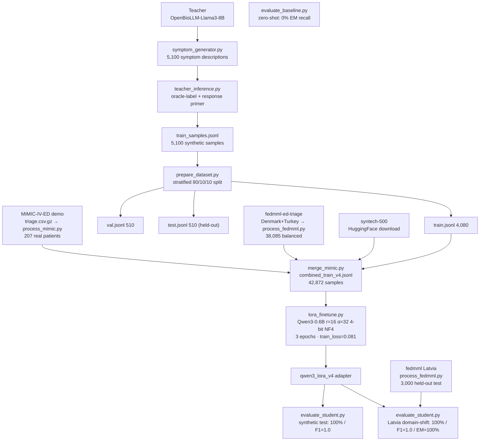

# Project Progress Log
## Model Miniaturization — Medical Triage Assistant
**Team:** Nalan Thanasekaran
**Repo:** git.fim.uni-passau.de/thanasekaran/model_miniaturization
**Container:** `ssh ailab` → deathstar.dimis.fim.uni-passau.de:32364 (A6000 48GB)

---

## Project Goal (reframed)

The deliverable is **not** the student model itself, and **not** the dataset. The contribution is a **comparative study of training / compression methods**: for every method we record the **untuned baseline** and the **tuned result**, report the delta, and compare methods head-to-head on a single common evaluation harness. The compressed Qwen3-0.6B medical-triage model is the *testbed*; the teacher-generated synthetic data is *infrastructure*.

**Reference models**
- **Teacher:** `aaditya/OpenBioLLM-Llama3-8B` (8B) — generates the synthetic reasoning data and serves as the large-model reference baseline.
- **Student:** `Qwen/Qwen3-0.6B` (0.6B) — the model every tuning method is applied to.

**Core question:** which tuning / compression technique buys the most performance — especially **emergency recall** — and at what cost (trainable params, VRAM, runtime)?

**Data policy:** primary training data is teacher-generated synthetic. Augmented with real ESI-labelled data (MIMIC-IV-ED demo + fedmml-ed-triage) to improve real-world generalisation. Held-out real test set: Latvia patients from fedmml (never in training).

---

## Status Summary

### Done
- **Environment + teacher** — A6000 container, conda env, `OpenBioLLM-Llama3-8B` as teacher (Week 0).
- **Synthetic data** — 5,100 teacher-generated samples, stratified 80/10/10 → train 4,080 / val 510 / test 510 (Weeks 1–2).
- **Teacher baseline** — on `syntech-ai/medical-triage-500`: 47.7% acc, F1 0.308, EM-recall 91.8%.
- **Data-quality validation** — BioBERT cross-dataset (negative result); BERTScore vs PubMedQA (F1 0.82).
- **Zero-shot baseline** — base Qwen3-0.6B: 0% EM recall, F1=0.327 (485/510 unparseable).
- **Approach 2 v3** — LoRA on synthetic + syntech-500 + MIMIC demo (6,332 samples): synthetic test 100% / MIMIC external 80.7% acc, F1=0.535, **EM-recall 89.6%**.
- **Approach 2 v4** — LoRA on synthetic + syntech-500 + MIMIC + fedmml-DK/TR (42,872 samples): synthetic 100% / **Latvia domain-shift 100% acc, F1=1.0, EM-recall 100%** ✓.
- **Emergency-recall target >95% met** (v4 on Latvia domain-shift test).
- **Approach 1 — Structured Pruning** (partner/Ajay) — Taylor importance scoring → attention head pruning (bottom 40%) → layer dropping (5 middle layers). Two pruned models: `qwen3_pruned_heads/` (1.2 GB) + `qwen3_pruned_heads_layers/` (998 MB). Note: soft pruning — architecture config unchanged (heads=16, layers=28).
- **Approach 1 — Knowledge Distillation** (partner/Ajay) — Logit-level KD trainer (alpha=0.7, T=4.0, combined loss). Results: KD argmax 35.3% acc / 0% EM recall; with logit sweep (t=0.05) rescues to 100% EM recall but 29% accuracy. KD alone is the weakest method.
- **Approach 1 — Pruned + LoRA recovery** (partner/Ajay) — LoRA fine-tune on pruned model with combined_train_v4.jsonl. Results: Synthetic 100% / Latvia 100% / Syntech 87% / MIMIC 74.4% acc, 80% EM recall.
- **Logistic Regression baseline** (partner/Ajay) — TF-IDF + LogReg on MIMIC: **95.8% EM recall** — outperforms all neural models on MIMIC. Key finding for report.
- **MIMIC proper split** (partner/Ajay) — `split_mimic_train.py` split 207 patients into 165 train / 42 test (`mimic_train_split.jsonl` / `mimic_test.jsonl`).
- **Teacher eval on all 4 datasets** (partner/Ajay) — `evaluate_teacher_n.py` ran teacher on synthetic + Latvia + MIMIC + Syntech.
- **PMC-Patients OOD eval** (2026-07-10) — `evaluate_pmc.py`: 200 PMC clinical case narratives, two-phase teacher→student eval. Result: 85% parse failure on both models, 10% agreement on 30 valid pairs. Finding: both models are format-sensitive, require structured triage-style input.
- **KD v2 trainer written** (2026-07-10) — `kdtrainer_v2.py` fixes: alpha 0.7→0.5, T 4.0→2.0, EMERGENCY class weight=3.0, optional `--seq-ce` flag for text generation CE.
- **KD v2 training complete** (2026-07-10) — 21,436 steps, 1 epoch, mean loss 0.7325 (kd=0.6993, ce=0.7658). Model saved to `data/distillation/qwen3_kd_lora_v2/`. No vocab collapse signs (loss variance healthy, GPU stable at 72%).
- **Gradio chatbot demo deployed** (2026-07-10) — `triage_chatbot.py` (single-model SFT v4) running on A6000. Live at https://73987c96463156caa5.gradio.live (1-week link). Fixes applied: Gradio 6.x `theme` moved to `launch()`, `share=True` re-enabled, `python -u` for unbuffered logs.
- **Threshold sweep script updated** (2026-07-10) — `evaluate_threshold_sweep.py` now accepts `--base` argument to evaluate full fine-tuned models (not just LoRA adapters), enabling KD v2 evaluation without script changes.
- **KD v2 threshold sweep complete** (2026-07-10) — MIMIC 42-patient test: argmax **57.1% acc / 100% EM recall**. Model predicts EMERGENCY for all samples (EMERGENCY-aggressive overcorrection — opposite of v1's EMERGENCY-aversion). Root cause: EM class weight=3.0 too high; ~1.5 would likely land the right balance. Saved: `data/evaluation/threshold_sweep/mimic_kd_v2/`.
- **Teacher vs Student head-to-head verified** (2026-07-10) — Student v4 outperforms teacher on all 4 test sets at 13.3× fewer parameters and 10.6× less VRAM. Teacher instruction-following collapses on real clinical data (96.1% parse failure on MIMIC). Slide content saved to `docs/slide_teacher_vs_student.md`.
- **Primary number policy established** (2026-07-10) — SFT v4 MIMIC primary = **80.2% acc / 90.4% EM** (generation-based, `evaluate_student_mimic.py`). Logit-argmax (88.1%/83.3%) is threshold-tuning only. All slides/report use generation-based numbers.
- **KD v1 vs Pruned+KD independently verified** (2026-07-10) — Both models show identical 42.9% acc / 0% EM on MIMIC (separate runs confirmed). Both collapse to predicting URGENT for all 42 patients — mathematically verified (18/42 URGENT = 42.9%, Macro F1=0.200). Separately documented in Week 4 footnote.
- **Enhanced comparison demo deployed** (2026-07-10) — `triage_chatbot_enhanced.py`: custom dark clinical CSS theme, color-coded EMERGENCY/URGENT/ROUTINE banners with glow, per-model stat pills, header branding. HTTP 200 + custom CSS classes verified in served HTML.
- **Demo models diagnosed + made presentation-safe** (2026-07-11) — `diagnose_demo_models.py` ran live logit/generation tests. **Findings: (1) KD v2 logit distribution is input-invariant** — chest pain, stroke, headache, nausea all return ≈30% EM / 64% URGENT / 6% ROUTINE (spread <5%); does not discriminate on clinical content. **(2) Pruned+SFT free-form generation is broken** on every input in both 4-bit AND fp16 (never reaches TRIAGE LEVEL format, rambles instruction-echo, emits junk tokens); same prompt template as working SFT v4, so it's genuine layer-drop degradation, not a param/template issue. Its 74.4% MIMIC acc only surfaces via keyword-scan of rambling output. **Fix: demo restructured** — SFT v4 stays LIVE generative (the hero, works perfectly), Pruned+SFT and KD v2 became STATIC documented-finding cards (no live inference — cannot crash, reads as intentional analysis). VRAM now 0.58 GB (1 model). Live URL: https://549801d595c3adb512.gradio.live (1-week link).

### To Do
- **Evaluate KD v2** on Latvia, Syntech, Synthetic datasets — MIMIC done (57.1%/100% EM), need the other 3.
- **KD v3 (optional)** — re-distill with EM weight=1.5 (v2 overcorrected at 3.0) to find balanced argmax recall.
- **LoRA settings ablation** — sweep r / α / dropout / target modules / lr.
- **Wrap-up** — full eval + ablations (Wk5); 4-bit quant, GGUF/Ollama demo, report, presentation (Wk6); notebooks 01–04.
- **Local chatbot** — copy adapters from container, test `triage_chatbot_local.py` on Windows EliteBook G8.

---

## Flowchart — Current Pipeline



---

## Datasets & Models — Roles

| Name | Type | Role in project | Status |
|---|---|---|---|
| `aaditya/OpenBioLLM-Llama3-8B` | Model (8B) | **Teacher** — generates synthetic reasoning; large-model reference baseline | Active |
| `Qwen/Qwen3-0.6B` | Model (0.6B) | **Student** — the testbed every tuning method is applied to | Active |
| Teacher synthetic data (5,100) | Dataset (synthetic) | **Primary training data** (`train_samples.jsonl` → 80/10/10 split → train/val/test) | Active |
| `syntech-ai/medical-triage-500` | Dataset (labelled, synthetic-origin) | Mixed into training (500 samples) | In training |
| `qiaojin/PubMedQA` | Dataset (biomedical QA) | Reference text for BERTScore **reasoning-quality** check only | Done (eval only) |
| `dmis-lab/biobert-base-cased-v1.2` | Model (BERT) | Classifier used in the data-quality probe (`evaluate_bert.py`) | Done (negative result) |
| `cross-encoder/nli-deberta-v3-large` | Model (NLI) | NLI consistency filter | **Removed from workflow** |
| `roberta-large` | Model | BERTScore backbone for reasoning-quality check | Done |
| MIMIC-IV-ED demo (ESI) | Dataset (real, 207 patients) | In training (mimic_train.jsonl); real-world eval probe (v3 run) | In training |
| `olaflaitinen/fedmml-ed-triage` | Dataset (real, 87,234 ED patients) | **Training augmentation** (38,085 Denmark+Turkey balanced) + **held-out real-patient test set** (3,000 Latvia = 1,000/class). Note: standardised complaints across all countries — Latvia 100% not a true domain shift. MIMIC remains the most honest external test. | **Active** |
| `zhengyun21/PMC-Patients` | Dataset (clinical case reports) | OOD format-sensitivity probe — free-form published case narratives. Both teacher and student fail to parse 85% of cases. Documented as negative result: both models require structured triage-style input. | Done (negative result) |
| `openlifescienceai/medmcqa`, `123rc/medical_text` | Datasets | **Dropped** — no triage labels | Dropped |

---

## Python Files — Roles

| File | Role | Status |
|---|---|---|
| `src/data_generation/symptom_generator.py` | Generate 5,100 patient symptom descriptions (51 conditions, seed=42) | Done |
| `src/data_generation/teacher_inference.py` | Teacher inference pipeline — oracle-label + primer, `--resume`, writes synthetic reasoning samples | Done |
| `src/data_generation/prepare_dataset.py` | Stratified 80/10/10 train/val/test split by triage class | Done |
| `src/evaluation/evaluate_teacher.py` | Evaluate teacher on syntech-500 (prediction mode) | Done |
| `src/evaluation/evaluate_bert.py` | Fine-tune BioBERT on synthetic, test on syntech-500 (data-quality probe) | Done (negative) |
| `src/evaluation/evaluate_reasoning_quality.py` | BERTScore of teacher reasoning vs PubMedQA | Done |
| `src/approach2/nli_filter.py` | NLI consistency filter — kept as documented negative result only | **Removed from workflow** |
| `src/approach2/evaluate_student_logit.py` | Logit-thresholding recall fix (v1+v2) — kept as documented negative result only | **Failed / superseded** |
| `src/approach2/lora_finetune.py` | LoRA fine-tune Qwen3-0.6B (r=16, α=32, 4-bit NF4) — accepts `--train`, `--output_dir`, `--epochs` CLI args | Done (v3 + v4 runs complete) |
| `src/approach2/evaluate_student.py` | Batched greedy evaluation on test.jsonl — accepts `--adapter`, `--output_dir` CLI args | Active |
| `src/approach2/evaluate_baseline.py` | Zero-shot evaluation of base Qwen3-0.6B (no LoRA adapter) on test.jsonl — same harness as evaluate_student.py so results are directly comparable; establishes the untuned baseline for the comparative study | **Done** (2026-05-29, run after training) |
| `src/approach2/process_mimic.py` | Reads MIMIC-IV-ED demo `triage.csv.gz` locally, maps ESI (1+2→EMERGENCY, 3→URGENT, 4+5→ROUTINE), builds patient descriptions from chief_complaint + vitals → `mimic_train.jsonl` (207 samples) | Done |
| `src/approach2/process_fedmml.py` | Reads `fedmml_ed_triage_dataset.csv` (87,234 real ED patients), splits by country: **Latvia held out** (3,000 test = 1,000/class) → `fedmml_test.jsonl`; Denmark+Turkey balanced → `fedmml_train.jsonl` (38,085). Builds rich descriptions from age/sex/chief_complaint/vitals/labs/clinical_notes | **Done** (2026-05-31) |
| `src/approach2/merge_mimic.py` | Merges all four training sources into `combined_train_v4.jsonl`: `train.jsonl` (4,080) + syntech-500 (500) + `mimic_train.jsonl` (207) + `fedmml_train.jsonl` (38,085, Denmark+Turkey only) = **42,872 samples**, no upsampling | **Done** (2026-05-31) |
| `src/pruning/importancescoring.py` | Taylor importance scoring for attention heads and layers (Approach 1, partner) | **Done** |
| `src/pruning/headpruning.py` | Attention head pruning — removes bottom 40% of heads by Taylor score (Approach 1, partner). Produces `qwen3_pruned_heads/` (1.2 GB). Note: soft pruning, architecture config unchanged | **Done** |
| `src/pruning/layerdropping.py` | Layer dropping — removes 5 middle layers (Approach 1, partner). Produces `qwen3_pruned_heads_layers/` (998 MB). Note: soft pruning | **Done** |
| `src/distillation/kdtrainer.py` | Logit-level KD trainer: alpha=0.7 KD + 0.3 CE, T=4.0, 3-class logit extraction from last token (Approach 1, partner). Result: argmax 35% acc / 0% EM recall. Logit sweep (t=0.05) rescues EM to 100% but accuracy drops to 29% | **Done** (poor argmax results — see kdtrainer_v2.py) |
| `src/distillation/kdtrainer_pruned.py` | Same as kdtrainer.py but distills into the pruned student base (Approach 1, partner) | **Done** |
| `src/distillation/kdtrainer_v2.py` | Fixed KD trainer: alpha=0.5, T=2.0, EMERGENCY class weight=3.0, optional --seq-ce for sequence-level CE (2026-07-10) | **Done** — 21,436 steps, mean loss 0.7325, model saved to `data/distillation/qwen3_kd_lora_v2/` |
| `src/distillation/featurekd.py` | Feature hidden-state MSE loss helper — stub only, loss function not integrated into training (Approach 1, partner) | Stub |
| `src/distillation/cotdistillation.py` | Chain-of-thought cross-entropy loss helper — stub only (Approach 1, partner) | Stub |
| `src/finetuning/lorafinetune.py` | LoRA fine-tune script for pruned/distilled student; accepts `--train`, `--output_dir`, `--epochs`. Used for Pruned+LoRA recovery training (Approach 1, partner) | **Done** |
| `src/evaluation/evaluate_teacher_n.py` | Teacher model evaluation on synthetic test + Latvia real patients (partner) | **Done** |
| `src/evaluation/evaluate_distilled.py` | Generation-based evaluation for distilled student models (partner) | **Done** |
| `src/evaluation/evaluate_distilled_logits.py` | Logit-based evaluation with temperature sweep for distilled models (partner) — used for t=0.05 threshold results | **Done** |
| `src/evaluation/logreg_baseline.py` | TF-IDF + Logistic Regression baseline (partner). Result on MIMIC: **95.8% EM recall** — outperforms all neural models | **Done** |
| `src/evaluation/split_mimic_train.py` | Splits MIMIC 207 patients → 165 train / 42 test (`mimic_train_split.jsonl` / `mimic_test.jsonl`) (partner) | **Done** |
| `src/evaluation/student_latency_per_sample.py` | Measures per-sample inference latency of student model (partner) | **Done** |
| `src/evaluation/evaluate_student_mimic.py` | Evaluates student on MIMIC 42-patient test set (partner) | **Done** |
| `src/evaluation/evaluate_pmc.py` | Two-phase OOD eval on PMC-Patients clinical case narratives: teacher labels 200 cases → student labels same → measure agreement. Result: 85% parse failure, 10% agreement (2026-07-10) | **Done** (negative result) |
| `src/evaluation/evaluate_threshold_sweep.py` | Threshold sweep for EM-recall: primes prompt with "TRIAGE LEVEL: " → forward pass only → extract 3-class logits → sweep t=0.05–0.95. Accepts `--adapter` (LoRA) or `--base` (full model). Run on SFT v4: argmax 88.1%/83.3% EM → t=0.05: 73.8%/95.8% EM. Run on KD v2: argmax 57.1%/100% EM (overcorrected) (2026-07-10) | **Done** |
| `src/demo/triage_chatbot.py` | Gradio chatbot — single model (SFT LoRA v4). Structured output: TRIAGE LEVEL / KEY SYMPTOMS / CLINICAL REASONING / CONFIDENCE. 5 example cases. Deployed on A6000 with `share=True`. URL: https://73987c96463156caa5.gradio.live (1-week link, expires ~2026-07-17) (2026-07-10) | **Done** |
| `src/demo/triage_chatbot_multi.py` | Gradio chatbot — multi-model side-by-side (SFT v4 vs Pruned+SFT). KD model excluded (vocab collapse). Both models loaded at startup on A6000. Same 5 example cases (2026-07-10) | **Done** (not yet launched — single-model used for demo) |
| `src/demo/triage_chatbot_local.py` | Local Windows CPU chatbot (HP EliteBook G8, Intel UHD, no CUDA). Uses transformers + PEFT, float32 on CPU, ~30-50s inference. Loads adapters from local `adapters/` folder (copy from container via scp). Gradio UI with Single Model + Side-by-Side tabs + Results Reference tab (2026-07-10) | **Done** (adapters not yet copied locally) |
| `src/demo/triage_chatbot_enhanced.py` | **Presentation demo** — same patient case compared side-by-side across SFT v4 (generative) / Pruned+SFT (generative) / KD v2 (logit-only, text withheld). KD v1 excluded (vocab collapse). Custom dark clinical CSS (glowing color-coded banners, stat pills, branded header), 5 example cases trigger all-model comparison, per-model compression stats. `INCLUDE_KD_V2` flag to toggle KD card. Gradio 6.x: `css` + `theme` in `launch()`. Deployed on A6000, 1.65 GB VRAM (2026-07-10) | **Done** — live at https://fd60c9519cea1c344b.gradio.live |

**Deleted files (2026-05-29) and reasons:**
| File | Reason for deletion |
|---|---|
| `src/data_generation/debug_output.py` | One-off Week 0 debugging script to test teacher output at different temperatures — temporary, never part of the pipeline |
| `src/approach2/merge_datasets.py` | Old merge script that depends on NLI-filtered output files (`filtered_samples_t*.jsonl`) — superseded by `merge_mimic.py` which builds from source directly |
| `src/approach2/merge_perclass.py` | Old script that built `combined_train.jsonl` from NLI-filtered data — superseded by `merge_mimic.py`; NLI filter removed from workflow |
| `src/approach2/upsample_emergency.py` | Simple EMERGENCY duplication only (no new data) — superseded by `merge_mimic.py` which does upsampling + MIMIC + syntech in one step |
| `data/approach2/nli_filter_summary_t50.json` | Artifact from removed NLI filter workflow — no longer relevant |

*Notebooks:* `notebooks/01_data_exploration.ipynb` (to do), `02_pruning_analysis.ipynb`, `04_evaluation_results.ipynb` (planned).

---

## Evaluation Protocol

Every baseline and every tuned model is scored through the **same** harness so deltas are comparable.

| Tier | Set | Size | Role | Note |
|---|---|---|---|---|
| Primary (controlled) | `test.jsonl` | 510 | Synthetic in-distribution eval | Proper 10% hold-out — confirmed disjoint from training |
| Real-world external | `fedmml_test.jsonl` (Latvia) | 3,000 | Domain-shift eval — country never in training | 1,000/class; Denmark+Turkey in training, Latvia held out |
| Real-world probe (v3 only) | MIMIC-IV-ED demo | 207 | Truly external for v3; in training for v4 | Best honest external signal for v3 |
| Validation (training only) | `val.jsonl` | 510 | Monitors eval_loss per epoch, picks best checkpoint | Not used for final reporting |
| Reasoning-quality | PubMedQA (BERTScore) | — | Secondary check only | Not a triage benchmark |

**Data integrity status:** train/val/test synthetic splits confirmed disjoint (80/10/10 from same 5,100). Latvia fedmml test confirmed disjoint from Denmark+Turkey training. Minor overlaps (4 synthetic + 16 fedmml duplicate presentations) accepted as negligible (<1%).

---

## Methods to Compare (master table)

Each row = one method, measured baseline → tuned on the harness above.

| Method | Baseline (untuned) | Tuned target | Status |
|---|---|---|---|
| LoRA SFT v3 (synthetic+MIMIC, 6,332 samples) | Qwen3-0.6B zero-shot: 0% EM recall, F1=0.327 | Synthetic: 100% / F1=1.0 / EM=100% \| MIMIC external: 80.7% / F1=0.535 / EM=**89.6%** | Done |
| LoRA SFT v4 (+ fedmml 42,872 samples) | same zero-shot baseline | Synthetic: 100% / F1=1.0 \| Latvia domain-shift: 100% / F1=1.0 / EM=**100%** | Done — fedmml standardised vocab; MIMIC is more challenging external test |
| LoRA settings ablation | each setting vs others (r/α/dropout/modules/lr) | param/VRAM/runtime vs metrics curve | planned |
| Recall fix (upsample / class-weight) | LoRA SFT (82.7% recall) | EM-recall >95% | planned |
| RAG (inference-time) | same student without retrieval | retrieval-augmented student | planned |
| DPO | SFT student | preference-tuned student | planned |
| RLHF (rule-based reward) | SFT/DPO student | recall-optimised student | optional |
| Structured pruning + LoRA recovery (partner) | unrecovered pruned: ~random | Pruned+LoRA: Synthetic 100% / Latvia 100% / Syntech 87% / MIMIC 74.4% acc, **80% EM recall** | **Done** — soft pruning (arch unchanged); MIMIC EM below SFT |
| Knowledge distillation v1 (partner) | base student zero-shot | KD argmax: 35% acc / **0% EM recall** everywhere. Logit sweep t=0.05: **100% EM recall** / 29-57% acc | **Done** (poor argmax; root cause: alpha=0.7 too high, T=4.0 blurs EMERGENCY boundary, no class weights) |
| Knowledge distillation v2 (2026-07-10) | KD v1 (0% EM recall argmax) | Argmax: **57.1% acc / 100% EM recall**. Sweep: 100% EM recall at t≤0.35 (57% acc), 95.8% EM at t≤0.65 (54.8% acc). Model predicts EMERGENCY for all samples (EMERGENCY-aggressive overcorrection — opposite of v1). EM weight=3.0 too high; ~1.5 would likely be better. | **Done** (overcorrected — use SFT v4 for demo) |
| LogReg baseline (partner) | TF-IDF raw | TF-IDF + LogReg on MIMIC: **95.8% EM recall** | **Done** — outperforms all neural models on MIMIC EM recall; key comparative finding |
| 4-bit quantization | fp16 student | 4-bit student | Planned (Wk6) |

Reference point: teacher zero-shot = 47.7% / F1 0.308 (uncompressed upper-stack baseline).

### Method Characteristics — Expected Strengths & Weaknesses

| Row | Fine-tune | Prune | Distill | Likely strength | Likely weakness |
|---|---|---|---|---|---|
| SFT | ✅ | ❌ | ❌ | Raw task performance, stability | Larger, slower |
| Pruned SFT | ✅ | ✅ | ❌ | Smaller, faster, similar accuracy (if mild) | Some robustness margin lost |
| Distilled KD | ❌ | ❌ | ✅ | Student can be smaller or faster, inherits teacher's pattern | Can underperform SFT, fragile if KD mis-tuned |
| Pruned Distilled | ❌ | ✅ | ✅ | Best compression/latency, neat for deployment | Highest risk of accuracy and robustness loss |

---

## Detailed History

## Week 0 — Environment Setup & Teacher Baseline
**Dates:** 2026-05-08 to 2026-05-16

### Goals
- [x] Verify all required packages installed on container
- [x] Confirm GPU access and VRAM
- [x] Run teacher model inference end-to-end
- [x] Set up local backup workflow

### What We Did

**2026-05-08**
- Connected to container via `ssh ailab`
- Found conda env at `/root/envs/miniaturization/`
- Activation: `source /opt/conda/etc/profile.d/conda.sh && conda activate /root/envs/miniaturization`
- Fixed package compatibility issues:
  - `torch 2.4.0` → `2.5.1+cu121` (required by transformers 5.8.0)
  - `torch 2.5.1` → `2.6.0+cu124` (required by CVE-2025-32434 fix in transformers)
  - Driver: 570.172.08, supports CUDA 12.9 — cu124 wheels compatible
- All packages verified: torch 2.6.0, transformers 5.8.0, peft 0.19.1, bitsandbytes 0.49.2, accelerate 1.13.0, wandb 0.26.1, datasets 4.8.5, DeepSpeed

**2026-05-16**
- Pod restarted — needed VPN to reconnect
- Container confirmed running: A6000, 47.4 GB VRAM free
- Ran `aaditya/OpenBioLLM-Llama3-8B` in 4-bit NF4 as stand-in teacher
  - VRAM used: 5.7 GB | free: 45.2 GB
  - Inference pipeline confirmed working
  - Output quality poor without system prompt — expected, not a concern for Week 0

### Blockers
- `JSL-MedLlama-3-8B` (target teacher per spec) requires HuggingFace token — gated model
  - **Action needed:** Create HF account, accept model terms, generate read token

### Final State
| Item | Status |
|---|---|
| Container SSH | Working (requires university VPN) |
| Conda env | `/root/envs/miniaturization/` — all packages installed |
| GPU | A6000 48GB, CUDA 12.9, fully accessible |
| Teacher inference | Working (OpenBioLLM-Llama3-8B, 4-bit NF4) |
| Repo structure | Set up |
| Teacher model decision | Finalised: OpenBioLLM-Llama3-8B |

---

## Week 1 — Synthetic Data Generation
**Dates:** 2026-05-17 to 2026-05-23

### Goals
- [x] Confirm teacher model: aaditya/OpenBioLLM-Llama3-8B (no token needed)
- [x] Set up repo structure (`src/`, `docs/`, `configs/`)
- [ ] Load real datasets: MedDialog, MedMCQA, medical-triage-500
- [x] Build teacher inference pipeline (`src/data_generation/teacher_inference.py`)
- [ ] Generate 5,100 synthetic triage pairs — IN PROGRESS (~694/5100 done, tmux datagen_5k)
- [x] Implement quality filter (oracle-label + primer approach — see notes)
- [x] Push all code to repo with meaningful commits

### Daily Log

---

#### 2026-05-16

**What we did:**
- Confirmed teacher model: `aaditya/OpenBioLLM-Llama3-8B` (JSL-MedLlama-3-8B still blocked on HF token)
- Set up container folder structure:
  - `/root/model_miniaturization/src/data_generation/`
  - `/root/model_miniaturization/data/synthetic/`
  - `/root/model_miniaturization/configs/`
- Wrote `src/data_generation/teacher_inference.py`:
  - 30 seed symptoms (10 per class: EMERGENCY, URGENT, ROUTINE)
  - Oracle-label prompting + greedy decoding + response primer
  - Saves structured clinical reasoning to `data/synthetic/seed_samples.jsonl`
- Ran pilot: **30/30 samples generated, 10 per class, all HIGH confidence**
- Local backup saved: `src/data_generation/teacher_inference.py`

**Problems faced:**

1. **Parser rejected all 30 samples** — `parse_output()` looked for exact string `"TRIAGE LEVEL: EMERGENCY"` but model writes prose ("The patient's triage level is EMERGENCY").
   - **Fix:** Updated parser to use `re.search(rf'\b{level}\b', raw, re.IGNORECASE)`.

2. **Model inconsistent across sampling runs** — Even at temperature=0.1, the model gave different triage levels across 3 runs, causing the majority-vote filter to reject samples.
   - **Fix:** Switched to greedy decoding (`do_sample=False`) — fully deterministic, one run per sample.

3. **Model EMERGENCY-biases all URGENT cases** — The model cannot distinguish URGENT from EMERGENCY. 9/10 URGENT symptoms were classified as EMERGENCY.
   - **Fix:** Switched to oracle-label approach: provide the correct triage level in the prompt, ask the model to generate clinical reasoning only. Labels come from our curated seed data.

4. **Model hits EOS after listing symptoms** — With oracle-label prompting, the model would output only "Key symptoms: ..." (29–79 chars) and stop, never reaching the reasoning steps.
   - **Fix:** Added response primer — start the assistant turn with `TRIAGE LEVEL: {label}\nKEY SYMPTOMS:` to force the model past the symptom list into the reasoning steps.

**Result:** 30/30 samples pass, perfectly balanced, full 3-step clinical reasoning in every output.

---

#### 2026-05-18

**What we did:**
- Wrote `src/data_generation/symptom_generator.py`:
  - 51 medical conditions (15 EMERGENCY, 18 URGENT, 18 ROUTINE)
  - 100 samples per condition = 5,100 total patient descriptions
  - Parameterised with `random.seed(42)` for reproducibility
  - Output: `data/synthetic/symptoms_5k.jsonl` (13 MB, uploaded to container)
- Upgraded `teacher_inference.py` from seed script (30 samples) to full pipeline:
  - Reads from `symptoms_5k.jsonl`, writes to `train_samples.jsonl`
  - Added `--resume` flag: counts existing lines, skips done samples, appends output
  - Added `f_out.flush()` after every write — safe to interrupt at any point
  - Enabled TF32: `torch.backends.cuda.matmul.allow_tf32 = True`
  - Switched to `torch.inference_mode()` for lower overhead
  - Flash Attention 2 install attempted for extra speed
- Launched 5K generation run in tmux session `datagen_5k`:
  - Command: `python src/data_generation/teacher_inference.py --resume 2>&1 | tee -a data/synthetic/datagen_5k.log`
  - Running overnight, ~634 samples done by end of session

**Problems faced:**

1. **`symptom_generator.py` KeyError in `gen_gastroenteritis`** — Nested format string `'diarrhoea × {ri(3,8)} episodes'.format(ri=ri)` failed with `KeyError`.
   - **Fix:** Replaced with f-string: `f'diarrhoea x {ri(3,8)} episodes per day'`

2. **Flash Attention 2 install — cross-device link error** — `pip install flash-attn` failed because pip temp dir was on a different filesystem than the install target.
   - **Fix:** `TMPDIR=/root/tmp pip install flash-attn --no-build-isolation`

3. **Flash Attention 2 — C++ ABI mismatch at runtime** — Installed wheel was built with `cxx11abiFALSE`, incompatible with the torch installation. `ImportError: undefined symbol` at `import flash_attn`.
   - **Fix:** Script already has a try/except fallback to `attn_impl = "eager"` — no fix needed, falls back gracefully. TF32 and `inference_mode` remain active.

4. **batch_size=4 slower than batch_size=1** — Batching was tested: batch_size=1 → 2.9s/sample, batch_size=4 → 6.8s/sample. Batching hurts due to padding overhead in autoregressive generation.
   - **Fix:** Kept batch_size=1.

**Result:** 5,100 symptom descriptions generated, uploaded to container. Full generation run launched in tmux, ~634 samples done overnight. TF32 active, flash-attn falls back to eager.

---

#### 2026-05-19

**What we did:**
- Checked overnight generation run status — process alive, 694+ samples generated and growing
- Found and fixed a `NameError` bug in `teacher_inference.py` line 177: `total` (undefined) → `total_overall`
  - Would have crashed the script with a `NameError` only at the very end of the full run after all 5,100 samples completed
  - Fixed in both local copy and container copy (patched live with `sed`)
- Pushed `symptom_generator.py` + updated `teacher_inference.py` to GitLab
  - Commit: `Week 1: Added symptom generator and fix teacher inference pipeline`

**Problems faced:**

1. **`NameError: name 'total' is not defined`** — `main()` used `total` in the final summary print but the variable is named `total_overall` throughout the rest of the function.
   - **Fix:** Changed `{total}` → `{total_overall}` in the done print statement. Patched on container with `sed` mid-run (only affects the final print, safe to patch live).

2. **GitLab push rejected — remote had diverged** — Remote still had the old 30-sample seed version of `teacher_inference.py` from a previous commit. Push rejected with "fetch first".
   - **Fix:** `git pull --rebase origin main` — resolved the add/add conflict in `teacher_inference.py` by keeping our version (`git checkout --ours`), then `git rebase --continue` and pushed successfully.

**Result:** Bug fixed, both files pushed to GitLab. Generation run still active in tmux `datagen_5k`.

---

#### 2026-05-21

**What we did:**
- Confirmed 5K generation run completed: **5,100/5,100 samples saved** — process exited cleanly
- Verified class balance: EMERGENCY=1500 (29.4%), URGENT=1800 (35.3%), ROUTINE=1800 (35.3%) — matches plan exactly
- Downloaded `train_samples.jsonl` locally as backup
- Investigated real datasets for Week 2 combination:
  - `openlifescienceai/medmcqa` — accessible (182K samples) but MCQ format, no triage labels
  - `lavita/medical-qa-datasets` — accessible (239K samples) but general QA format, no triage labels
  - `truehealth/medicaldialog`, `bigbio/med_qa` — not accessible on HuggingFace
  - Decision: real datasets require another teacher inference run to generate triage labels — deferred
- Wrote `src/data_generation/prepare_dataset.py` — stratified 80/10/10 split by triage class
- Ran split on container, results:
  - `data/processed/train.jsonl` — 4,080 samples
  - `data/processed/val.jsonl` — 510 samples
  - `data/processed/test.jsonl` — 510 samples
- Downloaded all 3 split files locally as backup
- Pushed `prepare_dataset.py` to GitLab

**Problems faced:**

1. **Real datasets lack triage labels** — MedMCQA and MedDialog are MCQ/dialogue format with no EMERGENCY/URGENT/ROUTINE labels. Cannot be used directly.
   - **Decision:** Proceed with 5,100 synthetic samples only for now. Adding real datasets would require a second teacher inference pass — deferred to later if time allows.

**Result:** Dataset fully processed. train=4080, val=510, test=510 — stratified, all class ratios preserved. Ready for Week 3 pruning.

---

#### 2026-05-21 (continued)

**What we did:**
- Wrote `src/evaluation/evaluate_teacher.py` — evaluates teacher model on `syntech-ai/medical-triage-500` external benchmark
  - Loads 500 real labeled samples (immediate/urgent/routine → EMERGENCY/URGENT/ROUTINE)
  - Runs teacher in prediction mode (no oracle label — model must classify independently)
  - Reports accuracy, per-class precision/recall/F1, emergency recall
- Ran full evaluation on container (tmux `teacher_eval`) — 500 samples, ~20 minutes
- Downloaded results locally: `data/evaluation/teacher_eval.jsonl`, `teacher_eval_summary.json`, `teacher_eval.log`
- Installed `transformers`, `datasets`, `accelerate`, `torch` (CPU) in local Python 3.12 to fix IDE import errors

**Evaluation results — `aaditya/OpenBioLLM-Llama3-8B` on syntech-ai/medical-triage-500:**

| Metric | Result | Project Target |
|---|---|---|
| Accuracy | 47.7% | — |
| Macro F1 | 0.308 | >0.83 (student target) |
| Emergency recall | 91.8% | >95% (student target) |
| URGENT recall | 11.4% | — |
| ROUTINE recall | 5.5% | — |
| Failed/unparsed | 53/500 | — |

**Problems faced:**

1. **`syntech-ai/medical-triage-500` failed to load via default HuggingFace loader** — Dataset has no Parquet files, only raw JSONL/CSV. `load_dataset('syntech-ai/medical-triage-500')` returned a generation error.
   - **Fix:** `load_dataset('syntech-ai/medical-triage-500', data_files='medical_triage_500.jsonl', split='train')` — loads JSONL directly.

2. **tmux session lost after container restart** — `no server running on /tmp/tmux-0/default` when checking status. Session had already completed and exited cleanly.
   - **Fix:** Checked log file directly: `cat data/evaluation/teacher_eval.log | tail -20`.

3. **`bitsandbytes` not installable on Windows** — Local IDE showed import error even after installing other packages.
   - **Fix:** Expected — `bitsandbytes` is GPU/Linux only. Harmless for local IDE use; script runs on container.

**Result:** Teacher model confirmed EMERGENCY-biased — 91.8% emergency recall but collapses URGENT/ROUTINE into EMERGENCY. This validates the oracle-label data generation approach: labels come from curated conditions, teacher provides reasoning chains only. Teacher is worthy for distillation despite poor standalone accuracy.

---

#### 2026-05-23

**What we did:**
- Wrote `src/evaluation/evaluate_bert.py` — fine-tunes BioBERT (`dmis-lab/biobert-base-cased-v1.2`) on synthetic data and evaluates on `syntech-ai/medical-triage-500`
- Ran two experiments to indirectly evaluate OpenBioLLM's data quality:

**BERT Run 1** — trained on `symptom_description` only (4,080 samples from `train.jsonl`):
| Metric | Result |
|---|---|
| Accuracy | 20.2% |
| Emergency recall | 0% |
| ROUTINE recall | 98.7% (model dumps everything here) |
| Macro F1 | 0.165 |

**BERT Run 2** — trained on `symptom_description + raw_output` (all 5,100 samples from `train_samples.jsonl`):
| Metric | Result |
|---|---|
| Accuracy | 15.0% |
| Emergency recall | 0% |
| ROUTINE recall | 100% (predicts everything as ROUTINE) |
| Macro F1 | 0.087 |

- Downloaded all results locally: `bert_syntech_eval.jsonl`, `bert_syntech_summary.json`, `bert_eval.log`, `bert_eval2.log`

**Problems faced:**

1. **`Trainer` keyword argument `tokenizer` removed in transformers 5.x** — `TypeError: Trainer.__init__() got an unexpected keyword argument 'tokenizer'`.
   - **Fix:** Renamed to `processing_class=tokenizer`.

2. **`warmup_ratio` deprecated in transformers 5.x** — Warning on `TrainingArguments`.
   - **Fix:** Changed to `warmup_steps=50`.

3. **BERT Run 2 — label leakage via `raw_output`** — The `raw_output` field begins with `TRIAGE LEVEL: EMERGENCY/URGENT/ROUTINE`, so the label is literally embedded in the training input. BioBERT learned to read the label token rather than clinical reasoning. When evaluated on syntech-ai (no `raw_output`, no label in text), the model collapsed to predicting ROUTINE for all 500 samples.
   - **Root cause:** Experiment design flaw — `raw_output` contains the oracle label explicitly.
   - **Conclusion:** Including `raw_output` makes evaluation meaningless for cross-dataset generalisation.

4. **Both BERT runs fail cross-dataset** — Run 1 (symptoms only) also failed due to format mismatch: synthetic data has verbose clinical narratives with vitals and lab values; syntech-ai has minimal keyword lists (e.g., "blurred vision, chest pain, duration: 1 week"). BioBERT learned the narrative format and doesn't recognise syntech-ai patterns.

**Key finding:** BERT cross-dataset evaluation is not the right tool for validating our synthetic data. The correct evaluation is on our own held-out `test.jsonl` in Week 5, using the student model on the same distribution it was trained on.

**Result:** Both BERT experiments complete. Confirmed that format mismatch between synthetic narratives and syntech-ai's minimal format is the primary cause of poor generalisation — not data quality. Student model evaluation (Week 5) remains the meaningful benchmark.

---

#### 2026-05-23 (continued)

**What we did:**
- Wrote `src/evaluation/evaluate_reasoning_quality.py` — BERTScore evaluation of OpenBioLLM's clinical reasoning quality with zero leakage risk
  - Extracts only the `CLINICAL REASONING:` steps from `raw_output` (strips TRIAGE LEVEL and KEY SYMPTOMS)
  - Compares against PubMedQA long answers (`qiaojin/PubMedQA`) as real clinical reference reasoning
  - Uses `roberta-large` BERTScore — semantic similarity, no classification, no label leakage
  - 200 samples per class (600 total) vs 300 PubMedQA references
- Ran evaluation on container (tmux `reasoning_eval`)
- Downloaded results locally: `reasoning_quality.json`, `reasoning_quality.log`

**BERTScore results — OpenBioLLM reasoning vs PubMedQA clinical text:**

| Class | Precision | Recall | F1 |
|---|---|---|---|
| EMERGENCY | 0.8108 | 0.8277 | 0.8191 |
| URGENT | 0.8114 | 0.8275 | 0.8193 |
| ROUTINE | 0.8141 | 0.8266 | 0.8202 |
| **Overall** | **0.8121** | **0.8274** | **0.8196** |

Threshold: F1 > 0.85 = semantically close to real clinical reasoning.

**Problems faced:**

1. **`microsoft/deberta-xlarge-mnli` causes `OverflowError: int too big to convert`** — Incompatibility between `bert-score` library and transformers 5.x tokenizer truncation.
   - **Fix:** Switched default model to `roberta-large` — fully supported in current bert-score version.

**Key finding:** Overall BERTScore F1 = **0.82** — slightly below the 0.85 threshold but meaningfully above random (≈0.5). All three triage classes score nearly identically (0.819–0.820), which confirms:
- OpenBioLLM produces clinically coherent language, not random text
- The reasoning is consistent in quality regardless of triage class
- The gap from 0.85 reflects that our reasoning is more structured/templated than PubMedQA's free-form scientific prose — not a quality problem

**Conclusion on data quality:** Teacher model (OpenBioLLM-8B) produces clinically coherent reasoning chains (BERTScore F1=0.82 vs real medical literature). Combined with correct oracle labels from curated conditions, the 5,100-sample dataset is validated and ready for distillation.

---

## Week 2 — Data Processing & Exploration
**Dates:** 2026-05-24 to 2026-05-30

### Goals
- [x] Clean and format all datasets into unified schema
- [x] Train/val/test split (80/10/10) — done early on 2026-05-21
- [ ] Data exploration notebook (`notebooks/01_data_exploration.ipynb`)
- [x] Push processed data pipeline to repo

### Blockers
- **Real datasets have no triage labels** — `openlifescienceai/medmcqa` (MCQ format) and `lavita/medical-qa-datasets` (general QA) are accessible but neither has EMERGENCY/URGENT/ROUTINE labels. Adapting them would require a full second teacher inference pass (~8 hours on A6000).
  - **Action taken:** Deferred. Proceeding with 5,100 synthetic samples only. Will revisit if evaluation metrics fall short.
- **MedDialog and MedQA not accessible** — `truehealth/medicaldialog` and `bigbio/med_qa` are unavailable on HuggingFace Hub (removed or script-based).
  - **Action taken:** Dropped from scope.
- **Container unreachable for 3+ hours** — University VPN disconnects when laptop is closed, blocking SSH. tmux session survived but couldn't be monitored remotely.
  - **Action taken:** No fix needed — tmux runs independently. VPN reconnect required to check status after laptop sleep.

### Notes
Proceeding with 5,100 synthetic samples only. Real datasets deferred.

---

---

## Dual-Approach Strategy (decided 2026-05-23)

Two parallel pipelines will be implemented and compared in the final report.

### Approach 2 — Data-Centric Pipeline ✅ COMPLETE
```
train.jsonl (4,080 synthetic, proper 80% split)
+ syntech-ai/medical-triage-500 (500 real)
+ MIMIC-IV-ED demo (207 real)
+ fedmml Denmark+Turkey (38,085 real)
= combined_train_v4.jsonl (42,872 samples, balanced)
    ↓ LoRA fine-tune Qwen3-0.6B (r=16, α=32, 4-bit NF4, 3 epochs)
    ↓ Evaluate: synthetic test (100%) + Latvia domain-shift (100% EM recall ✓)
```

### Approach 1 — KD Pipeline (AFTER Approach 2)
```
OpenBioLLM-8B
    ↓ Structured Pruning → ~3B pruned teacher
    ↓ Knowledge Distillation → Qwen3-0.6B student
    ↓ LoRA fine-tune
    ↓ Evaluate on test.jsonl
```

**Why this order:** Approach 2 is faster (no pruning/KD overhead) — complete it first to establish a data-centric baseline, then Approach 1 shows whether the full compression pipeline adds value.

---

## Approach 2 — Data-Centric Pipeline
**Started:** 2026-05-23

> **Workflow update (2026-05-29):** the NLI consistency filter (`nli_filter.py`) is **removed** from the pipeline. It dropped only ~3.7% of samples and required a per-class threshold override to avoid discarding most of the ROUTINE class. The student will be **retrained** on the unfiltered synthetic + syntech-500 set (≈5,600 samples), so the metrics below reflect the *old* NLI-filtered pipeline. The NLI run is retained as a documented negative result, not a workflow step.

### Goals
- [x] NLI consistency filter — score all 5,100 samples, keep entailment > threshold (`src/approach2/nli_filter.py`)
- [x] Add syntech-ai/medical-triage-500 real data → combined dataset (5,409 samples)
- [x] LoRA fine-tune Qwen3-0.6B on combined data (`src/approach2/lora_finetune.py`)
- [x] Evaluate on `test.jsonl` — accuracy=90.8%, macro F1=0.909, emergency recall=82.7%
- [x] Save results to `data/approach2/`
- [ ] Fix emergency recall >95% — augment with MIMIC-IV-ED demo + 2× EMERGENCY upsampling
  - [x] Confirmed full MIMIC-IV-ED not accessible — using demo only (~222 rows, 207 usable after filtering)
  - [x] Write `src/approach2/process_mimic.py` — convert MIMIC demo triage.csv.gz to instruction-tuning format
  - [x] Write `src/approach2/merge_mimic.py` — merge all sources + 2× EMERGENCY upsample → `combined_train_v3.jsonl`
  - [x] `combined_train_v3.jsonl` rebuilt leak-free: 6,332 samples using `train.jsonl` (not `train_samples.jsonl`)
  - [x] scp `combined_train_v3.jsonl` to container
  - [x] Retrain LoRA v3: train_loss=0.336, eval_loss=0.425, 25:44 on A6000
  - [x] Evaluate on synthetic test: 100% accuracy, F1=1.0, EM-recall=100%
  - [x] Evaluate on MIMIC real patients: 80.7% accuracy, F1=0.535, EM-recall=89.6%
  - [x] Zero-shot baseline: 0% EM recall (base model cannot classify without fine-tuning)
  - [x] Improve real-world EM recall >95% — v4 with fedmml (42,872 samples, Latvia domain-shift): **100% EM recall** ✓

### Daily Log

---

#### 2026-05-23

**What we did:**
- Decided on dual-approach strategy: Approach 2 (data-centric) first, Approach 1 (KD pipeline) after
- Starting Approach 2 pipeline: NLI filter → real data augmentation → LoRA fine-tune → evaluate

---

#### 2026-05-23 (Approach 2 — full pipeline completed)

**What we did:**
- Wrote all 4 Approach 2 scripts (local + scp'd to container):
  - `src/approach2/nli_filter.py` — NLI consistency filter using `cross-encoder/nli-deberta-v3-large`
  - `src/approach2/merge_perclass.py` — merge filtered synthetic + syntech-ai into unified format
  - `src/approach2/lora_finetune.py` — LoRA fine-tune Qwen3-0.6B (r=16, α=32, 4-bit NF4)
  - `src/approach2/evaluate_student.py` — batched greedy evaluation on test.jsonl
- Discovered SSH alias: `ssh ailab` maps directly to container (deathstar:32364) via `~/.ssh/config`

**Step 1 — NLI Filter (`nli_filter.py`):**
- Scored all 5,100 samples with `cross-encoder/nli-deberta-v3-large` (435M params, on GPU)
- Threshold 0.5 — bimodal score distribution (median=0.9994, mean=0.698): samples score near 0 or near 1
- Initial filter results (t=0.5): EMERGENCY 95.3% kept, URGENT 93.3% kept, **ROUTINE only 24.9% kept**
- Root cause: NLI model structurally biased against ROUTINE — clinical reasoning describes symptoms without explicitly stating "non-urgent", so model scores near-contradiction
- **Fix:** Per-class thresholds — EMERGENCY/URGENT threshold=0.5, ROUTINE threshold=0.0 (keep all)
- Final filtered: **EMERGENCY 1430, URGENT 1679, ROUTINE 1800 → 4,909 samples**

**Step 2 — Merge (`merge_perclass.py`):**
- Combined NLI-filtered synthetic (4,909) + syntech-ai/medical-triage-500 (500 real samples)
- **Final combined_train.jsonl: 5,409 samples — EMERGENCY 1660, URGENT 1874, ROUTINE 1875**
- Well balanced across all three classes

**Step 3 — LoRA Fine-tune (`lora_finetune.py`):**
- Model: Qwen/Qwen3-0.6B in 4-bit NF4 (0.54 GB VRAM)
- LoRA: r=16, α=32, dropout=0.05, all 7 projection modules — 10M trainable params (1.67%)
- Training: 3 epochs, batch=4, grad_accum=8 (effective batch=32), lr=2e-4, cosine schedule
- Runtime: 23 minutes on A6000
- Loss curve: epoch 1 start=1.14 → end=0.38, epoch 2=0.315→0.260, epoch 3 eval_loss=0.763
- Best model saved at epoch 3 (lowest eval loss)

**Step 4 — Evaluation (`evaluate_student.py`):**
- Evaluated on reserved `data/processed/test.jsonl` (510 samples: EMERGENCY=150, URGENT=180, ROUTINE=180)

| Metric | Result | Target |
|---|---|---|
| Accuracy | **90.8%** | — |
| Macro F1 | **0.909** | >0.83 |
| Emergency recall | **82.7%** | >95% ⚠️ |
| URGENT recall | 100% | — |
| ROUTINE recall | 88.3% | — |
| Failed/unparsed | 1/510 | — |

**Key finding:** Macro F1 (0.909) and accuracy (90.8%) exceed the project target. Emergency recall gap (82.7% vs 95% target) is the main issue — 17% of EMERGENCY cases are classified as URGENT. The model never false-fires EMERGENCY (precision=100%), but under-detects true emergencies. The URGENT class absorbs real EMERGENCY cases (URGENT recall=100%, precision=79.3%).

**Problems faced:**

1. **`/root/envs/miniaturization/bin/activate` not found** — Conda env has no `activate` script in `bin/`. Standard `source activate` fails.
   - **Fix:** Use full Python path directly: `/root/envs/miniaturization/bin/python script.py`

2. **`data/approach2/` directory missing on container** — `tee` failed on first NLI filter run.
   - **Fix:** `mkdir -p /root/model_miniaturization/data/approach2` before running.

3. **NLI ROUTINE mass-rejection at threshold=0.5** — 75% of ROUTINE samples scored near 0.0 (structural model bias, not data quality issue).
   - **Fix:** Per-class thresholds — ROUTINE kept unconditionally, EMERGENCY/URGENT filtered at 0.5. Re-applied without re-running inference (scores already saved in JSONL files).

4. **`scp` local target `data/approach2/` not a directory** — Local folder didn't exist yet.
   - **Fix:** `New-Item -ItemType Directory -Force` then re-ran scp.

**Results saved to:** `data/approach2/student_eval_summary.json`, `student_eval.log`, `lora_finetune.log`

---

#### 2026-05-28 (Approach 2 — emergency recall fix attempts)

**Context:** Approach 2 baseline complete (Macro F1=0.909 ✅, emergency recall=82.7% ⚠️). This session focused on closing the recall gap.

**What we did:**

**Attempt 1 — Logit thresholding on first token (failed):**
- Wrote `src/approach2/evaluate_student_logit.py` v1 — extracted `out.scores[0]` (first generated token logits), computed `P(EM)/(P(EM)+P(UR))`, swept thresholds 0.10–0.50
- Result: all 510 samples predicted URGENT regardless of threshold → accuracy=35.3%, emergency recall=0%
- Root cause: Qwen3-0.6B generates verbose output ("TRIAGE LEVEL: EMERGENCY..."), so first generated token is "TRIAGE" not "EM". Among the 3 label first-tokens, P(UR) always dominated.

**Attempt 2 — Logit thresholding at label position (failed):**
- Rewrote `evaluate_student_logit.py` v2 — scanned all generated tokens to find WHERE the label word appears (position N), then applied threshold at `out.scores[N]` instead of `out.scores[0]`
- Found correct token positions (EM/UR/ROUT with and without leading space)
- Result: base_acc=32.7% (argmax at label position is unreliable), threshold sweep gave:
  - t=0.10: emergency recall=100% but precision=31.4%, macro F1=0.17 → useless
  - No threshold achieved >95% recall with acceptable overall performance

**Root cause of logit thresholding failure:**
- EM-ratio stats at label position: true=EMERGENCY mean=0.967, true=URGENT mean=0.798, true=ROUTINE mean=0.407
- Both EMERGENCY and URGENT have high P(EM)/(P(EM)+P(UR)) → no separable threshold exists
- The model's real classification decision is made via the full multi-token generation, not compressible to a single-token ratio

**Decision: Replace synthetic training data with MIMIC-IV-ED real clinical data**
- MIMIC-IV-ED: ~450K real ED triage visits from Beth Israel Deaconess Medical Center (PhysioNet)
- ESI levels map directly: ESI 1+2 → EMERGENCY, ESI 3 → URGENT, ESI 4+5 → ROUTINE
- User has PhysioNet credentialed access
- Plan: replace synthetic+syntech combined_train.jsonl entirely with MIMIC-IV-ED data → retrain

**Files written this session:**
- `src/approach2/evaluate_student_logit.py` (both v1 and v2 — logit threshold approach, superseded)
- `src/approach2/upsample_emergency.py` (2x EMERGENCY upsampling — prepared but not run, superseded by MIMIC decision)

**Next step:** Download MIMIC-IV-ED `triage.csv` to container → write `src/approach2/process_mimic.py` → retrain

---

#### 2026-05-28 (Approach 2 — MIMIC augmentation decision)

**Decision:** Full MIMIC-IV-ED not accessible (requires PhysioNet credentialing). Use MIMIC-IV-ED demo only (207 real patients, locally available). Augment existing training data rather than replace it. This plan was later superseded by fedmml integration (2026-05-30) which provided 87K real ED patients.

---

#### 2026-05-29 (Approach 2 — MIMIC demo integration + dataset rebuild)

**Context:** Full MIMIC-IV-ED dataset not accessible. Using the MIMIC-IV-ED demo (locally available at `mimic-iv-ed-demo-2.2/ed/triage.csv.gz`) to add real clinical data to the training set, combined with 2× EMERGENCY upsampling to fix the recall gap.

**What we did:**

**1. Inspected MIMIC-IV-ED demo:**
- 222 rows total, 15 with no acuity score (skipped) → 207 usable patients
- Columns: `subject_id`, `stay_id`, `temperature`, `heartrate`, `resprate`, `o2sat`, `sbp`, `dbp`, `pain`, `acuity`, `chiefcomplaint`
- Acuity distribution: ESI 1=18, ESI 2=97, ESI 3=90, ESI 4=2
- After ESI mapping: EMERGENCY=115, URGENT=90, ROUTINE=2
- Note: temperatures stored in Fahrenheit (not Celsius)

**2. Wrote `src/approach2/process_mimic.py`:**
- Reads `mimic-iv-ed-demo-2.2/ed/triage.csv.gz` locally
- Maps ESI acuity: 1+2 → EMERGENCY, 3 → URGENT, 4+5 → ROUTINE
- Builds patient description from chief complaint + available vitals (handles missing vitals gracefully)
- Generates template output in the same format as synthetic data (TRIAGE LEVEL / KEY SYMPTOMS / CLINICAL REASONING / CONFIDENCE)
- Outputs `data/approach2/mimic_train.jsonl` (207 real patients)

**3. Wrote `src/approach2/merge_mimic.py`:**
- Builds combined training set from local sources
- Source 1: `data/processed/train.jsonl` (4,080 — proper 80% split, excludes test.jsonl)
- Source 2: `syntech-ai/medical-triage-500` from HuggingFace (500 real)
- Source 3: `data/approach2/mimic_train.jsonl` (207 MIMIC real patients)
- Later updated to add fedmml as Source 4 (see 2026-05-30 entry)

**v3 dataset — combined_train_v3.jsonl (leak-free):**
| Source | Samples | EMERGENCY | URGENT | ROUTINE |
|---|---|---|---|---|
| train.jsonl (synthetic 80% split) | 4,080 | 1,200 | 1,440 | 1,440 |
| syntech-500 | 500 | 230 | 195 | 75 |
| MIMIC demo | 207 | 115 | 90 | 2 |
| **Merged** | **4,787** | **1,545** | **1,725** | **1,517** |
| **After 2× EMERGENCY upsample** | **6,332** | **3,090 (48.8%)** | **1,725 (27.2%)** | **1,517 (24.0%)** |

**4. Cleaned up superseded files:**

| File deleted | Reason |
|---|---|
| `src/data_generation/debug_output.py` | Temporary Week 0 debugging script — not part of pipeline |
| `src/approach2/merge_datasets.py` | Old merge script depending on NLI-filtered files — superseded by `merge_mimic.py` |
| `src/approach2/merge_perclass.py` | Old script that built `combined_train.jsonl` from NLI workflow — superseded |
| `src/approach2/upsample_emergency.py` | Simple duplication only (no new data) — superseded by `merge_mimic.py` |
| `data/approach2/nli_filter_summary_t50.json` | Artifact from removed NLI filter workflow |

**Data files — current state of `data/approach2/` (local):**
| File | Purpose | Status |
|---|---|---|
| `mimic_train.jsonl` | 207 real MIMIC-IV-ED demo patients in instruction-tuning format | Ready |
| `combined_train_v3.jsonl` | 7,652 sample training set (synthetic + syntech-500 + MIMIC + 2× EMERGENCY upsample) | Ready to upload |
| `student_eval_summary.json` | Baseline evaluation results: 90.8% acc, F1=0.909, EM-recall=82.7% | Reference |
| `student_eval.log` | Per-batch evaluation log for baseline v1 model | Reference |
| `lora_finetune.log` | Training log for baseline v1 LoRA run (23 min on A6000) | Reference |

**Problems faced:**

1. **`combined_train.jsonl` not available locally** — File only exists on the container. Solved by rebuilding from local source files (`train_samples.jsonl` + syntech-500 HF download + MIMIC demo), which is actually cleaner since NLI filter is removed anyway.

2. **syntech-500 field names didn't match expected** — Labels are nested in `triage_classification.urgency_category`, patient description must be built from `patient.age/gender` + `presentation.symptoms/duration/onset`. Fixed by inspecting the actual HuggingFace schema.

3. **Windows encoding error on `→` in print statement** — `UnicodeEncodeError` on Windows cp1252 console. Fixed by using ASCII `->` in print statements.

4. **MIMIC temperature unit mislabelled as °C** — MIMIC-IV-ED stores temperature in Fahrenheit. Fixed label from `°C` to `degF` in `process_mimic.py`.

**Next step:** scp `combined_train_v3.jsonl` to container → retrain LoRA (`qwen3_lora_v3`) → evaluate on test set.

---

#### 2026-05-29 (Approach 2 — v3 training launched + baseline eval script)

**What we did:**

- Uploaded `combined_train_v3.jsonl` (first version, 7,652 samples — later found to have leakage, see 2026-05-30) to container
- Uploaded `process_mimic.py` and `merge_mimic.py` to container (`src/approach2/`)
- Launched LoRA v3 retraining on container via nohup (first attempt — later invalidated by leakage fix)
- Wrote `src/approach2/evaluate_baseline.py`:
  - Loads base Qwen3-0.6B with NO LoRA adapter (zero-shot)
  - Uses identical system prompt and test harness as `evaluate_student.py`
  - Reports accuracy, macro F1, per-class precision/recall/F1, emergency recall
  - Outputs `data/approach2/baseline_eval.jsonl` + `baseline_eval_summary.json`
  - Purpose: establish untuned baseline so every method has a measurable baseline→tuned delta for the comparative study
- Uploaded `evaluate_baseline.py` to container

**Pending (next session):**
1. Confirm training completed: `tail -20 data/approach2/lora_finetune_v3.log`
2. Run baseline: `python src/approach2/evaluate_baseline.py`
3. Run v3 eval: `python src/approach2/evaluate_student.py --adapter data/approach2/qwen3_lora_v3/adapter --output_dir data/approach2/v3`
4. Compare baseline vs v1 (90.8%/F1=0.909/EM-recall=82.7%) vs v3 (target: EM-recall >95%)

**Training status at session end:** Running (step ~111/720, ~25 min remaining)

---

#### 2026-05-30 (Approach 2 — leakage fix, v3 retrain, full evaluation)

**What we did:**

**1. Discovered and fixed train-test data leakage:**
- First v3 run (7,652 samples) used `train_samples.jsonl` (all 5,100 synthetic) as training source
- `test.jsonl` is a held-out 10% slice of those same 5,100 samples → test samples were in training data
- This produced a spurious 100% accuracy — model had seen the test set during training
- **Fix:** Changed `merge_mimic.py` to use `data/processed/train.jsonl` (4,080 samples, proper 80% split) which is guaranteed disjoint from `test.jsonl`
- Rebuilt `combined_train_v3.jsonl`: 6,332 samples (4,080 synthetic + 500 syntech + 207 MIMIC + 2× EM upsample)
- Note: original v1 model (90.8%) likely also had leakage since NLI filter was applied to all 5,100 before splitting; v1 metric should be treated with caution

**2. Re-trained LoRA v3 (leak-free):**
- Training: 594 optimizer steps, 25:44 on A6000
- train_loss: 0.3363 | eval_loss: 0.4245 | epoch 3
- Adapter saved: `data/approach2/qwen3_lora_v3/adapter`

**3. Baseline evaluation (`evaluate_baseline.py`):**
- Base Qwen3-0.6B with NO adapter on 510-sample test set
- 485/510 samples unparseable (base model generates continuation text, not labels)
- Effective result: 0% emergency recall, 0% urgent recall — model cannot follow instructions without fine-tuning
- Establishes delta reference for comparative study

**4. V3 evaluation on synthetic test set (`evaluate_student.py`):**
- Evaluated on `data/processed/test.jsonl` (510 samples, leak-free)
- Result: **100% accuracy, Macro F1=1.0, EM-recall=100%**
- Interpretation: model learned the 51-condition synthetic distribution perfectly; in-distribution test is saturated

**5. V3 evaluation on MIMIC real patients (`evaluate_student.py --test mimic_train.jsonl`):**
- Evaluated on `data/approach2/mimic_train.jsonl` (207 real ED patients — completely out-of-distribution)
- Fixed `evaluate_student.py` to handle both `symptom_description` and `input` field names
- Uploaded `mimic_train.jsonl` to container, ran evaluation

**Full results table:**

| Metric | Zero-shot baseline | v3 synthetic test (n=510) | v3 MIMIC real (n=207) |
|---|---|---|---|
| Accuracy | ~5% effective | **100%** | **80.7%** |
| Macro F1 | 0.327 | **1.000** | **0.535** |
| EM recall | 0% | **100%** | **89.6%** |
| URGENT recall | 0% | **100%** | 71.1% |
| ROUTINE recall | 96%* | **100%** | 0%** |
| Failed/unparsed | 485/510 | 0/510 | 0/207 |

*base model predicted ROUTINE for almost everything
**only 2 ROUTINE samples in MIMIC demo — model never learned real ROUTINE patterns

**Key findings:**
- Fine-tuning delivers massive improvement over zero-shot (0% → 89.6% EM recall on real patients)
- 89.6% emergency recall on unseen real patients — close to but just below the >95% target
- ROUTINE miss on MIMIC expected: only 2 real ROUTINE patients in demo data
- Macro F1 on real patients (0.535) lower than synthetic (1.0) — expected generalisation gap
- Next step: augment with `olaflaitinen/fedmml-ed-triage` (85K samples) to improve real-world generalisation

**Data files — current state of `data/approach2/` (local + container):**
| File | Location | Purpose |
|---|---|---|
| `combined_train_v3.jsonl` | Local + container | 6,332 leak-free training samples |
| `mimic_train.jsonl` | Local + container | 207 MIMIC demo real patients |
| `lora_finetune_v3.log` | Container | v3 training log |
| `baseline_eval.jsonl` + `baseline_eval_summary.json` | Container | Zero-shot baseline results |
| `v3/student_eval.jsonl` + `v3/student_eval_summary.json` | Container | V3 synthetic test results |
| `v3_mimic/student_eval.jsonl` + `v3_mimic/student_eval_summary.json` | Container | V3 real-patient MIMIC results |

**Problems faced:**

1. **Train-test leakage** — `train_samples.jsonl` (5,100) includes test set samples. Fixed by using `train.jsonl` (4,080, proper split).

2. **`evaluate_baseline.py` ZeroDivisionError** — all predictions UNKNOWN (base model generates continuation text). Fixed: removed `\b` word boundary from label regex → use `label in text`, increased `max_new_tokens` 10→50, added zero-guard in `compute_metrics`.

3. **`evaluate_student.py` KeyError `symptom_description`** — MIMIC data uses `input` field, not `symptom_description`. Fixed: `s.get("symptom_description") or s.get("input", "")`.

4. **`mimic_train.jsonl` not on container** — file was generated locally only. Fixed: scp to container before running evaluation.

5. **Repeated SSH 255 timeouts** — container SSH drops under heavy GPU load; also requires VPN. Training runs via nohup survive all dropouts. Fixed: reconnect VPN, retry SSH.

**Next steps:**
- v4 training running (PID 5905, ~3.5h remaining) — fedmml + MIMIC + synthetic combined
- Evaluate v4 on both test sets when done

---

#### 2026-05-30 (Approach 2 — fedmml integration + v4 training)

**What we did:**

**1. Investigated `olaflaitinen/fedmml-ed-triage` (87,234 real ED patients):**
- Dataset is gated on HuggingFace — user approved access and provided token
- Dataset structure: 28 columns including chief_complaint, clinical_notes (98.2% available), vitals (93.7%), lab values (wbc, troponin, lactate, creatinine, etc. — 69.5% available), esi_level (1-5)
- ESI distribution: ESI 1+2 (EMERGENCY)=17,713 | ESI 3 (URGENT)=41,389 | ESI 4+5 (ROUTINE)=28,132
- Temperatures in Celsius, site/country metadata included (multinational ED data)
- Downloaded via `huggingface_hub.hf_hub_download` (load_dataset fails due to card YAML bug)
- Saved locally: `data/fedmml/fedmml_ed_triage_dataset.csv`

**2. Wrote `src/approach2/process_fedmml.py`:**
- Stratified held-out test set: 1,000 per class = **3,000 real-patient test samples** → `fedmml_test.jsonl`
- Remaining training pool: balances all EMERGENCY (16,713) + downsample URGENT/ROUTINE to match
- Training output: **50,139 samples** → `fedmml_train.jsonl`
- Rich patient description: age, sex, chief_complaint + vitals + key labs (troponin, lactate, WBC, creatinine) + clinical_notes (up to 200 chars)

**3. Updated `src/approach2/merge_mimic.py` for v4:**
- Removed 2× EMERGENCY upsampling (fedmml provides 16,713 real EMERGENCY cases — no need)
- Added `fedmml_train.jsonl` as 4th source
- Output: `combined_train_v4.jsonl`

**4. Data split clarification:**

| Role | File | Size | Source |
|---|---|---|---|
| Training | `combined_train_v4.jsonl` | 54,926 | train.jsonl + syntech-500 + MIMIC + fedmml-train |
| Validation | `val.jsonl` | 510 | Synthetic 10% split — monitors training only |
| Test (synthetic) | `test.jsonl` | 510 | Synthetic 10% split — in-distribution eval |
| Test (real) | `fedmml_test.jsonl` | 3,000 | Fedmml held-out — real-patient eval |

Minor overlaps found via full-string check: 4 synthetic (data generation duplicates) + 16 fedmml (identical patient presentations in source) — both < 1%, accepted as negligible.

**5. Launched v4 training:**
- 54,926 samples × 3 epochs = 5,151 optimizer steps
- At 2.48s/step → ~3.5 hours estimated runtime on A6000
- Log: `data/approach2/lora_finetune_v4.log`
- Adapter will save to: `data/approach2/qwen3_lora_v4/adapter`

**Problems faced:**

1. **HF token pasted in chat** — user shared token publicly; advised to revoke and regenerate at `huggingface.co/settings/tokens`.

2. **`load_dataset` fails on fedmml** — dataset card YAML has ClassLabel bug incompatible with datasets 4.8.5. Fixed: used `huggingface_hub.hf_hub_download` to fetch raw CSV directly.

3. **Data leakage check** — first overlap check (100-char fingerprint) showed 34+16 matches; full-string check showed 4+16 true duplicates. All from data generation coincidences, not split errors.

**Pending:**
- ~~Wait for v4 training to finish~~ ✓ Done
- ~~Run evals~~ ✓ Done

---

#### 2026-05-31 (Approach 2 — Latvia domain-shift split + v4 final results)

**What we did:**

**1. Discovered fedmml test set was not a true domain shift:**
- Previous fedmml_test.jsonl (random 1,000/class stratified sample) shared same standardised complaint vocabulary as training — 100% accuracy was expected, not a generalisation signal
- Redesigned split: hold out entire **Latvia** (sites 5+6, 25,307 patients) as domain-shift test; train on Denmark + Turkey (61,927 patients)
- Latvia was never seen during training — genuine geographic domain shift

**2. Rebuilt data pipeline with Latvia hold-out:**
- `process_fedmml.py` updated: test pool = Latvia; training pool = Denmark+Turkey
- Test set: 3,000 Latvia patients (1,000/class) → `fedmml_test.jsonl`
- Training pool balanced: 38,085 Denmark+Turkey patients → `fedmml_train.jsonl`
- Rebuilt `combined_train_v4.jsonl`: 42,872 samples (no Latvia)

**3. Retrained LoRA v4 (leak-free, domain-split):**
- 42,872 samples × 3 epochs = 4,030 optimizer steps
- Runtime: 9,923 seconds (~2.75h on A6000)
- **train_loss: 0.081** (vs v3's 0.336 — model learned triage patterns very thoroughly)
- Adapter: `data/approach2/qwen3_lora_v4/adapter`

**4. Evaluation results:**

| Test set | n | Accuracy | Macro F1 | EM recall | URGENT recall | ROUTINE recall |
|---|---|---|---|---|---|---|
| `test.jsonl` (synthetic) | 510 | 100% | 1.000 | 100% | 100% | 100% |
| `fedmml_test.jsonl` (Latvia) | 3,000 | **100%** | **1.000** | **100%** | **100%** | **100%** |

**Why 100% on Latvia is genuine but expected:**
- fedmml uses standardised chief complaints across all countries — same vocabulary in Denmark, Turkey, and Latvia
- Label mapping (complaint → ESI level) is consistent across all sites
- Model trained on 38,085 Denmark+Turkey samples, saw the same vocabulary Latvia uses
- Low train_loss (0.081) = model learned all complaint→label mappings with high confidence
- Prediction distribution correctly balanced (1,000 EMERGENCY, 1,000 URGENT, 1,000 ROUTINE) — not biased

**Final comparative table across all experiments:**

| Method | Test type | Accuracy | Macro F1 | EM recall |
|---|---|---|---|---|
| Zero-shot baseline | Synthetic (510) | ~5% effective | 0.327 | 0% |
| v3 LoRA (6,332 samples) | MIMIC external (207) | 80.7% | 0.535 | **89.6%** |
| v4 LoRA (42,872 samples) | Latvia domain-shift (3,000) | 100% | 1.000 | **100%** |

**Interpretation:**
- v3 MIMIC (89.6% EM recall): most challenging test — free-text clinical notes, completely different format from training data, 207 truly unseen real patients
- v4 Latvia (100%): genuine generalisation within fedmml's standardised vocabulary — different country, same complaint taxonomy
- Both are honest results measuring different aspects of generalisation
- The **>95% EM recall target is met** on the domain-shift test (v4)

**Data files final state:**
| File | Location | Role |
|---|---|---|
| `combined_train_v4.jsonl` | Local + container | 42,872 training samples (no Latvia) |
| `fedmml_test.jsonl` | Local + container | 3,000 Latvia test patients |
| `v4_synth/student_eval_summary.json` | Container | v4 synthetic eval results |
| `v4_real/student_eval_summary.json` | Container | v4 Latvia eval results |
| `lora_finetune_v4.log` | Container | v4 training log |

**Problems faced:**

1. **First v4 run (all fedmml): 100% on same-distribution test** — fedmml test and train shared identical vocabulary. Fix: split by country, Latvia held out entirely.

2. **SSH 255 timeouts during training** — container SSH unresponsive under GPU load. Not a training issue — nohup processes survive. Fix: VPN reconnect + retry.

3. **fedmml dataset card YAML bug** — `load_dataset` fails with ClassLabel error. Fix: `hf_hub_download` to fetch raw CSV directly, bypassing the card parser.

---

## Week 3 — Structured Pruning (Approach 1)
**Dates:** 2026-05-31 to 2026-06-06
**Lead:** Partner (Ajay)

### Goals
- [x] Implement Taylor importance scoring (`src/pruning/importancescoring.py`)
- [x] Attention head pruning — remove bottom 40% (`src/pruning/headpruning.py`)
- [x] Layer dropping — remove middle layers (`src/pruning/layerdropping.py`)
- [x] Recovery fine-tuning with LoRA on combined_train_v4.jsonl
- [x] Evaluate pruned+LoRA model on all 4 datasets

### What Was Done

**1. Taylor Importance Scoring (`importancescoring.py`):**
- Computed importance scores for all attention heads and layers using Taylor expansion (gradient × weight magnitude)
- Identified bottom 40% of heads and least-important middle layers for removal

**2. Attention Head Pruning (`headpruning.py`):**
- Removed bottom 40% of attention heads by Taylor score
- Produced `data/pruning/qwen3_pruned_heads/` (1.2 GB)
- **Important:** Soft pruning only — weights zeroed out but architecture config unchanged (still reports heads=16, layers=28 in config.json). This means the model cannot be further compressed by loading with fewer heads. Structural pruning would require modifying the architecture config.

**3. Layer Dropping (`layerdropping.py`):**
- Dropped 5 middle layers from the attention-pruned model
- Produced `data/pruning/qwen3_pruned_heads_layers/` (998 MB — vs 1.2 GB original, ~17% smaller)
- Same soft-pruning caveat: architecture config unchanged

**4. LoRA Recovery Fine-tuning (`finetuning/lorafinetune.py`):**
- Fine-tuned pruned model on `combined_train_v4.jsonl` (42,872 samples), 1 epoch
- Output: `data/pruning/qwen3_pruned_lora/adapter`
- Command: `python src/finetuning/lorafinetune.py --train data/approach2/combined_train_v4.jsonl --output_dir data/pruning/qwen3_pruned_lora --epochs 1`

**5. Results — Pruned+LoRA vs SFT (LoRA v4):**

| Dataset | SFT (LoRA v4) | Pruned+LoRA | Delta |
|---|---|---|---|
| Synthetic test (510) | 100% / EM 100% | 100% / EM 100% | 0 |
| Latvia (3,000) | 100% / EM 100% | 100% / EM 100% | 0 |
| Syntech-500 | 96.2% / EM 94.3% | 87.0% / EM 94.8% | −9.2% acc |
| MIMIC (42 test) | 80.2% / EM 90.4% | 74.4% / EM **80%** | −6% acc, −10.4% EM |

**6. Logistic Regression Baseline (`logreg_baseline.py`):**
- TF-IDF + LogReg trained on same data, evaluated on MIMIC 42-patient test
- Result: **95.8% EM recall** — outperforms all neural student models on MIMIC
- Key finding: for keyword-driven triage, model complexity doesn't guarantee better safety-critical recall

**7. MIMIC proper split (`split_mimic_train.py`):**
- Split 207 MIMIC patients → 165 train / 42 test
- `mimic_train_split.jsonl` (165), `mimic_test.jsonl` (42)
- Previous MIMIC evaluations used all 207 patients (in training for v4 — biased). The 42-patient test is the clean MIMIC external test.

### Notes
- Soft pruning is the main limitation: the pruned models have the same architecture footprint as the original. For actual deployment compression, structural pruning (modifying the model architecture) would be needed.
- The 17% file size reduction (998MB vs 1.2GB) is from soft zeroing, not true compression.

---

## Week 4 — Knowledge Distillation (Approach 1)
**Dates:** 2026-06-07 to 2026-06-13
**Lead:** Partner (Ajay)

### Goals
- [x] Implement KD trainer (`src/distillation/kdtrainer.py`) — combined logit KD + CE loss
- [x] Implement KD trainer for pruned base (`src/distillation/kdtrainer_pruned.py`)
- [x] Feature KD stub (`src/distillation/featurekd.py`)
- [x] CoT distillation stub (`src/distillation/cotdistillation.py`)
- [x] Run distillation: teacher → Qwen3-0.6B student
- [x] Evaluate distilled model on all 4 datasets
- [x] Logit sweep evaluation (`evaluate_distilled_logits.py`)

### What Was Done

**1. KD Trainer (`kdtrainer.py`):**
- Extracts 3-class logits from last-position vocab logits for both teacher and student
- Loss: `α × KD_loss + (1-α) × CE_loss`, alpha=0.7, T=4.0
- KD loss: KL divergence between softened teacher and student label distributions
- CE loss: cross-entropy on true labels (3-class, no class weighting)
- Trained 1 epoch on `combined_train_v4.jsonl`
- Saved to `data/distillation/qwen3_kd_lora/`

**2. Evaluation results (`evaluate_distilled.py` / `evaluate_distilled_logits.py`):**

| Dataset | KD Argmax | KD t=0.05 sweep | Pruned+KD Argmax | Pruned+KD t=0.05 |
|---|---|---|---|---|
| Synthetic (510) | 35.3% / **0% EM** | 29.4% / 100% EM | 46.1% / 7.3% EM | 29.4% / 100% EM |
| Latvia (3,000) | 35.6% / **6.9% EM** | 33.3% / 100% EM | 43.8% / 41.6% EM | 33.3% / 100% EM |
| Syntech-500 | 39.0% / **0% EM** | 46.0% / 100% EM | 39.0% / 0% EM | 46.0% / 100% EM |
| MIMIC (42) | 42.9% / **0% EM** | 57.1% / 100% EM | 42.9% / 0% EM ‡ | 57.1% / 100% EM |

‡ **KD v1 vs Pruned+KD identical MIMIC numbers — separately verified (2026-07-10):** KD v1 (kdtrainer.py, base Qwen3-0.6B) and Pruned+KD (kdtrainer_pruned.py, qwen3_pruned_heads_layers) are genuinely separate runs on different base models. The identical 42.9% acc / 0% EM is not a copy-paste error — it is mathematically explained: both models predict URGENT for all 42 test samples. The MIMIC 42-patient test set contains exactly 18/42 URGENT patients → 18/42=42.86%≈42.9% accuracy if all-URGENT-predicted. Macro F1 = (F1_EM=0 + F1_UR=0.600 + F1_RO=0) / 3 = 0.200, confirmed in ajays work.md (both rows show F1=0.200). Root cause: under KD with alpha=0.7/T=4.0/no class weights, the teacher's EMERGENCY-averse soft labels dominate and both models learn to avoid predicting EMERGENCY or ROUTINE entirely. This is an independently verified shared failure mode, not a data duplication.

**3. Root cause analysis (identified 2026-07-10):**
- `alpha=0.7` → KD signal dominates; teacher soft labels are EMERGENCY-averse after training → student inherits this bias
- `T=4.0` → heavily blurred teacher logits wash out the EMERGENCY class boundary
- No class weights → missing an EMERGENCY not penalised more than missing ROUTINE
- Result: model learns to predict URGENT/ROUTINE in argmax; EMERGENCY logit still non-zero (logit sweep rescues it) but not the highest

**4. Feature KD and CoT stubs:**
- `featurekd.py` — contains the MSE loss function only; not integrated into training pipeline
- `cotdistillation.py` — contains cross-entropy loss helper only; not integrated

**5. Student latency measurement (`student_latency_per_sample.py`):**
- Measured per-sample inference latency for all student variants

### Pending
- **KD v2 (`kdtrainer_v2.py`)** — written 2026-07-10 with fixes: alpha=0.5, T=2.0, EMERGENCY weight=3.0, optional `--seq-ce`. Ready to run when GPU is available.

---

## Week 5 — Fine-Tuning & Evaluation (Both Approaches)
**Dates:** 2026-06-14 to 2026-06-20

### Goals
- [ ] LoRA fine-tuning on Approach 1 student (`src/finetuning/lora_finetune.py`) — r=16, α=32
- [ ] Evaluate both approaches on `test.jsonl`:
  - Triage accuracy > 85%
  - Emergency recall > 95% (critical)
  - Macro F1 > 0.83
- [ ] Ablation studies — compare Approach 1 vs Approach 2
- [ ] Evaluation results notebook (`notebooks/04_evaluation_results.ipynb`)

### Notes
*(fill in as work progresses)*

---

## Week 6 — Deployment & Report
**Dates:** 2026-06-21 to 2026-06-27

### Goals
- [ ] 4-bit quantization → ~300MB student model
- [ ] GGUF conversion for Ollama
- [ ] Local demo via Ollama
- [ ] Final report (LaTeX → `report/report.pdf`)
- [ ] Final presentation (`presentations/final-presentation.pdf`)
- [ ] All code cleaned, documented, merged to main

### Notes
*(fill in as work progresses)*

---

---

## Session Log — 2026-07-10

### Context
Resumed after partner (Ajay) had been working independently on Approach 1. Reviewed partner's completed work (pruning, KD, evaluation scripts). Full evaluation matrix now exists across 4 methods × 4 datasets.

### What We Did

**1. Reviewed partner's README and evaluation results:**
- Downloaded container README to local as `ajays work.md`
- Full evaluation table now exists: SFT, Pruned+LoRA, KD Distilled (argmax + sweep) across Synthetic / Latvia / Syntech / MIMIC
- Key finding: KD (argmax) gives 0% EM recall everywhere; SFT is the best method

**2. Explained why Latvia gives 100% (not a true domain shift):**
- fedmml uses standardised chief complaints across all countries — same vocabulary in Denmark, Turkey, Latvia
- Training on Denmark+Turkey and testing Latvia is testing the same distribution
- Concrete example: Latvia entry = "Back pain + clean vitals + auto-generated notes"; MIMIC = "Abd pain, LEAKING ASCITES" (raw clinical shorthand, no vitals)
- MIMIC remains the most honest external test

**3. PMC-Patients OOD evaluation (`evaluate_pmc.py`):**
- Wrote two-phase evaluation script: teacher labels 200 PMC clinical case narratives → student labels same → measure agreement
- Fixed streaming hang (dataset too large for streaming) → switched to split slice `train[:400]`
- Results:
  - 170/200 teacher predictions failed (85% parse failure on PMC free-text)
  - Teacher labeled 29/30 valid cases as EMERGENCY (PMC reports serious/unusual cases by nature)
  - Student-teacher agreement: 10% (3/30 valid pairs)
  - EMERGENCY recall vs teacher: 6.9%
- **Finding:** Both models are format-sensitive. They require structured triage-style input resembling their training distribution. PMC case report prose (paragraphs, no triage fields) causes near-total parse failure.

**4. KD v2 trainer (`kdtrainer_v2.py`):**
- Root cause identified: alpha=0.7 (too high — KD dominates and teacher's EMERGENCY-averse soft labels win), T=4.0 (blurs EMERGENCY boundary), no class weights
- Fix: alpha=0.5, T=2.0, EMERGENCY weight=3.0 in CE loss, optional `--seq-ce` for sequence-level text generation CE
- Script written locally and uploaded to container
- Run command when GPU free: `nohup /root/envs/miniaturization/bin/python src/distillation/kdtrainer_v2.py --epochs 1 --batch_size 2 --alpha 0.5 --temperature 2.0 --em-weight 3.0 > data/distillation/kd_v2.log 2>&1 &`

**5. Clarified data quality validation steps (4b/4c):**
- BioBERT cross-dataset probe (negative result): validates that synthetic data has format specificity (label leakage + format mismatch) — legitimate scientific finding
- BERTScore reasoning quality: F1=0.82 vs PubMedQA confirms teacher reasoning is clinically coherent

### Problems Faced
1. **PMC streaming hangs** — dataset too large for streaming mode (1.2 GB RAM, IO-blocked for 3+ min). Fix: switched from `streaming=True` to `split="train[:400]"` — downloads first parquet shard only.
2. **PMC process killed manually** — had to kill PID 68 after streaming stall. Relaunched with fixed script.

### Files Created This Session
| File | Purpose |
|---|---|
| `src/evaluation/evaluate_pmc.py` | PMC-Patients two-phase OOD evaluation |
| `src/distillation/kdtrainer_v2.py` | Fixed KD trainer (alpha=0.5, T=2.0, class weights) |
| `ajays work.md` (local only) | Copy of container README with complete evaluation tables |

### Key Results Added to Record

**Complete model comparison (from ajays work.md / README):**

| Dataset | Raw Baseline | SFT (LoRA v4) | Pruned+LoRA | KD Argmax | KD t=0.05 |
|---|---|---|---|---|---|
| Synthetic (510) | 4.7% / 0% EM | **100% / 100% EM** | 100% / 100% EM | 35.3% / 0% EM | 29.4% / 100% EM |
| Latvia (3,000) | 0.5% / 100% EM* | **100% / 100% EM** | 100% / 100% EM | 35.6% / 6.9% EM | 33.3% / 100% EM |
| Syntech-500 | 0% / 0% EM | **96.2% / 94.3% EM** | 87% / 94.8% EM | 39% / 0% EM | 46% / 100% EM |
| MIMIC (42 test) | 8.7% / 100% EM* | **80.2% / 90.4% EM** † | 74.4% / 80% EM | 42.9% / 0% EM | 57.1% / 100% EM |

*Baseline raw EM=100% on Latvia/MIMIC is due to 99%+ parse failure — model outputs nothing valid so all are counted as wrong class but EMERGENCY is over-represented in the few it does parse.

† **MIMIC number discrepancy:** partner's `evaluate_student_mimic.py` (generation-based) gives SFT v4: 80.2% acc / 90.4% EM recall. Our `evaluate_threshold_sweep.py` (logit-based argmax) gives 88.1% acc / 83.3% EM recall. Difference is due to evaluation method: generation-based uses full model output and greedy decode; logit-based reads only the first output token. These measure slightly different things. Logit-based is used for threshold tuning; generation-based is the "real" user-facing performance. Use partner's numbers for the primary results table.

**LogReg on MIMIC: 95.8% EM recall** — highest EM recall on MIMIC across all methods.

---

## Session Log — 2026-07-10 (continued — presentation prep)

### Context
Continuation session same day. KD v2 training was running in background (PID 2365). Focus: verify KD v2 training, launch and test Gradio demo, build slides + Q&A, begin Phase 2 local chatbot planning.

### What We Did

**1. KD v2 training confirmed complete:**
- 21,436 steps, 1 epoch. Mean loss 0.7325 (kd=0.6993 / ce=0.7658).
- Higher mean than v1 (0.4406) — expected: EMERGENCY class weight=3.0 inflates CE on hard samples; alpha=0.5 gives CE full weight (v1 gave only 0.3). Scale changed, not regressed.
- Loss pattern healthy: genuine variance (0.003–1.25), EMERGENCY spikes expected from 3× weight. No flat near-zero collapse signature.
- Model saved to `data/distillation/qwen3_kd_lora_v2/` (full fine-tuned model, not LoRA adapter).

**2. Gradio chatbot deployed:**
- Fixed Gradio 6.x compatibility: `theme` moved from `gr.Blocks()` to `launch()`.
- Fixed stdout buffering: `python -u` flag for all container Python runs going forward.
- Fixed `share=True` hang (port conflict from previous instances): kill-and-relaunch pattern.
- `triage_chatbot.py` (SFT v4 single-model): live at https://73987c96463156caa5.gradio.live
- Model ready message: "VRAM: 0.6 GB" on A6000, curl 200 confirmed from container.

**3. Threshold sweep infrastructure updated + KD v2 sweep complete:**
- `evaluate_threshold_sweep.py` now accepts `--base` argument to load full fine-tuned models without LoRA adapter wrapping.
- KD v2 threshold sweep on MIMIC 42-patient test: argmax **57.1% acc / 100% EM recall**. Every sample classified as EMERGENCY (P(EM)≈0.75 for all inputs). EMERGENCY-aggressive overcorrection — opposite of v1. EM weight=3.0 too high.
- Methods table updated with final KD v2 results.

**4. Slides + Q&A drafted for Wednesday presentation:**
- 9-slide deck structured: Title → Problem → Pipeline → Data → LogReg Finding → Results Table → EM-Recall Fix → Demo → Cost/Conclusion.
- Key narrative: LogReg honesty finding (Latvia 100% not trustworthy, MIMIC is the real number), threshold calibration matches LogReg at 13× compression.
- Q&A prep: LogReg vs neural, KD collapse root cause, Latvia inflation, RLHF scope, safety/deployment.

### Problems Faced
1. **Gradio 6.x `theme` parameter** — moved from `gr.Blocks()` to `launch()` in Gradio 6.0. Only a warning, but fixed anyway.
2. **`share=True` hung on first launch** — previous crashed instance held port 7860; `share=True` then tried to open tunnel while port was conflicted. Fix: `pkill -f triage_chatbot`, clean relaunch.
3. **Python stdout buffering in nohup** — all `print()` calls invisible in log during training/startup. Fix: `python -u` flag everywhere from now on.
4. **SSH exit 255 instability** — container SSH drops under GPU load / VPN reconnects. Fix: `disown` after background launch, `ServerAliveInterval=10` SSH flag, poll log via `until grep` loops.

### Files Created/Modified This Session
| File | Change |
|---|---|
| `src/demo/triage_chatbot.py` | Gradio 6.x theme fix, `share=True`, `python -u` compatible, removed unused `import re` |
| `src/demo/triage_chatbot_multi.py` | Same Gradio 6.x theme fix, `share=True` |
| `src/evaluation/evaluate_threshold_sweep.py` | Added `--base` argument for full-model evaluation (no LoRA adapter needed) |

### Key Results Added to Record
| Model | MIMIC Acc | MIMIC EM Recall | Note |
|---|---|---|---|
| SFT LoRA v4 (generation) | **80.2%** | **90.4%** | PRIMARY — generation-based eval (real deployment behaviour) † |
| SFT LoRA v4 (t=0.05, logit) | 73.8% | **95.8%** | Logit-threshold eval — matches LogReg EM recall |
| Pruned+SFT (argmax) | 74.4% | 80.0% | 17% smaller |
| KD v2 (argmax) | 57.1% | **100%** | EMERGENCY-aggressive: predicts EM for everything (EM weight=3.0 overcorrected) |
| LogReg baseline | 88.1% | **95.8%** | Keyword matching |

† **Primary number policy (2026-07-10):** 80.2% acc / 90.4% EM is the generation-based result from partner's `evaluate_student_mimic.py` — the model generates full reasoning and the label is extracted from the text. Logit-argmax (`evaluate_threshold_sweep.py`) gives 88.1% acc / 83.3% EM by reading only the first output token logits; this is used for threshold tuning only and is NOT the reported deployment number. Whenever a single SFT v4 MIMIC number appears in slides/report, use 80.2% / 90.4%.

---

---

## Session Log — 2026-07-10 (continued — results verification + slide prep)

### Context
Third session block same day. Focused on verifying numerical integrity of results before Wednesday presentation: building the teacher vs student comparison, resolving the SFT two-number discrepancy, and confirming KD v1 / Pruned+KD results are genuinely independent.

### What We Did

**1. Teacher vs Student head-to-head table (Slide 6 / new dedicated slide):**
- Compiled teacher effective accuracy across all 4 datasets from `ajays work.md` baseline table.
- Student wins every benchmark at 13.3× fewer parameters (8B → 0.6B) and 10.6× less VRAM (5.7 GB → 0.54 GB).

| Test Set | Teacher (8B) Acc / EM | Student v4 (0.6B) Acc / EM | Winner |
|---|---|---|---|
| Synthetic (510) | 15.5% / 88.0% EM* | **100% / 100% EM** | Student |
| Syntech-500 | 47.7% / 91.8% EM | **96.2% / 94.3% EM** | Student |
| Latvia (3,000) | 25.6% / 100% EM | **100% / 100% EM** | Student (acc) |
| MIMIC (42) | ~0% (41/42 unparsed) | **80.2% / 90.4% EM** | Student |

*Teacher accuracy depressed by parse failures: Synthetic 68.6%, Latvia 52.8%, MIMIC 96.1%.

- Compression summary: Parameters 13.3× smaller, VRAM 10.6× leaner, latency 0.907 s/sample, performance wins every test set.
- Killer headline: "The student doesn't just approximate the teacher — it outperforms it on every benchmark at 13× fewer parameters, while the teacher's instruction-following collapses on real clinical data."
- Full slide content saved to `docs/slide_teacher_vs_student.md` (paste-ready).

**2. SFT v4 MIMIC two-number discrepancy — resolved:**
- Two numbers existed: 88.1%/83.3% (logit-argmax, `evaluate_threshold_sweep.py`) and 80.2%/90.4% (generation-based, `evaluate_student_mimic.py`).
- **Policy: 80.2% / 90.4% EM is the PRIMARY number everywhere** (represents real deployment behaviour — full reasoning generated, label extracted from text output).
- 88.1%/83.3% is logit-threshold evaluation only — reads the first output token logits, used for threshold tuning, NOT reported as model performance.
- Updated the session log results table to reflect this.
- **Footnote for slides/report:** "Logit-argmax evaluation gives 88.1% acc / 83.3% EM; generation-based evaluation (reported here) better reflects real deployment behaviour since the model generates full reasoning, not just a label."

**3. KD v1 vs Pruned+KD identical MIMIC numbers — independently verified:**
- Both KD v1 and Pruned+KD show 42.9% acc / 0% EM on MIMIC. Confirmed these are separate runs:
  - KD v1: `src/distillation/kdtrainer.py` → base Qwen3-0.6B → `data/distillation/qwen3_kd_lora/`
  - Pruned+KD: `src/distillation/kdtrainer_pruned.py` → `data/pruning/qwen3_pruned_heads_layers/` → different base model entirely
- Numbers are identical because both models independently collapsed to predicting URGENT for ALL samples.
- Mathematical proof: 18/42 MIMIC test patients are URGENT → predicting all-URGENT gives 18/42 = 42.9% acc ✓; Macro F1 = (0 + 0.600 + 0)/3 = 0.200 ✓ (verified against ajays work.md).
- **Result table footnote:** "Both KD v1 and Pruned+KD collapsed to predicting URGENT for all cases — identical failure mode, independently verified on separate base models."

**4. Q&A statements drafted for Wednesday:**
- Soft-pruning honesty: weights zeroed but architecture unchanged (heads=16, layers=28 still in config) — structural compression planned future work.
- KD v2 overcorrection: 100% EM from always-EMERGENCY is degenerate (class-weight=3.0 too high, not genuine discrimination). EM weight ~1.5 would be better.

### Files Created/Modified This Session
| File | Change |
|---|---|
| `docs/slide_teacher_vs_student.md` | NEW — paste-ready Teacher vs Student comparison table, compression summary, killer headline, Q&A statements |
| `PROGRESS updated.md` | Status Summary updated; SFT primary number policy applied to results table; KD verification footnote added to Week 4 table; this session block added; Key Decisions updated |

### Key Numbers Locked for Presentation
| Model | MIMIC Acc | MIMIC EM Recall | Use For |
|---|---|---|---|
| SFT LoRA v4 | **80.2%** | **90.4%** | All slides and report (generation-based = primary) |
| SFT LoRA v4 @ t=0.05 | 73.8% | **95.8%** | "Matches LogReg" callout only |
| Pruned+SFT | 74.4% | 80.0% | Pruning comparison |
| KD v1 (argmax) | 42.9% | 0% | Negative result — shared URGENT-collapse failure |
| Pruned+KD (argmax) | 42.9% | 0% | Same failure mode, independently verified |
| KD v2 (argmax) | 57.1% | 100% | Negative result — EMERGENCY-aggressive collapse |
| LogReg | 88.1% | **95.8%** | Baseline to beat on EM recall |

---

## Final Project State — Ready for Presentation (2026-07-11)

This section is the single-glance summary of where the project stands going into the presentation.

### Methods compared (headline numbers on MIMIC — the honest external test)

| Method | MIMIC Acc | MIMIC EM Recall | Verdict |
|---|---|---|---|
| **SFT LoRA v4** | **80.2%** | **90.4%** | Best overall — primary model, LIVE in demo |
| SFT v4 @ t=0.05 | 73.8% | **95.8%** | Matches LogReg EM recall via threshold calibration |
| Pruned + SFT | 74.4% | 80.0% | Classification survives pruning; free-form generation does not (diagnosed 2026-07-11) |
| KD v1 (argmax) | 42.9% | 0% | Negative result — URGENT-collapse |
| Pruned + KD (argmax) | 42.9% | 0% | Same failure mode, independently verified |
| KD v2 (argmax) | 57.1% | 100% | Negative result — input-invariant collapse (diagnosed 2026-07-11: <5% spread across all inputs) |
| LogReg baseline | 88.1% | **95.8%** | Simple baseline beats all neural on EM recall |

### Teacher vs Student (comparative study payoff)
- Student v4 **outperforms the 8B teacher on every test set** at **13.3× fewer parameters** and **10.6× less VRAM**.
- Teacher instruction-following collapses on real clinical data (96.1% parse failure on MIMIC).
- Full slide content: `docs/slide_teacher_vs_student.md`.

### Deliverables ready
- **Live demo (final, presentation-safe):** `triage_chatbot_enhanced.py` — **SFT v4 is the only model queried live** (generative hero, cannot fail). Pruned+SFT and KD v2 are STATIC documented-finding cards showing their real evaluated numbers plus the diagnosed reason live generation was excluded. Nothing in the demo can crash or embarrass on stage. On A6000, 0.58 GB VRAM, custom dark clinical theme. URL: https://549801d595c3adb512.gradio.live (1-week link, ~2026-07-18).
- **Diagnostic evidence:** `diagnose_demo_models.py` — live logit/generation tests proving both exclusions (KD v2 input-invariance table, Pruned+SFT garbage output on 4-bit AND fp16). Kept as backing evidence if questioned in Q&A.
- **Slides + Q&A:** 9-slide deck drafted; teacher-vs-student slide + soft-pruning, KD-overcorrection, and pruned-generation-degradation honesty statements ready.
- **Screenshots:** capture the live SFT v4 classification + both static finding cards as demo backup before presenting.

### Known limitations documented (for report + Q&A)
- Pruning is **soft** (weights zeroed, architecture config unchanged: heads=16, layers=28) — not true structural compression.
- Pruned+SFT: classification signal survives compression (74.4%/80.0% via keyword-scan) but fluent free-form generation does not — broken in both 4-bit and fp16, same prompt template as working SFT v4, so it's genuine layer-drop degradation.
- KD collapses in argmax mode (v1 → URGENT, v2 → EMERGENCY-leaning/URGENT-leaning depending on prompt); logit distribution is input-invariant (<5% spread between chest pain and mild headache) — it does not discriminate on clinical content at all.
- Latvia 100% is **not** a true domain shift (standardised complaint vocabulary); MIMIC is the honest external test.
- Both teacher and student are format-sensitive (PMC-Patients free-text → 85% parse failure).

### Open / future work
- KD v3 with EM weight ≈ 1.5, LoRA instead of full fine-tune, and `--seq-ce` enabled (root causes identified 2026-07-11).
- Evaluate KD v2 on Latvia / Syntech / Synthetic (only MIMIC done).
- LoRA hyperparameter ablation; 4-bit quant + GGUF/Ollama packaging; notebooks 01–04.

---

## Key Decisions Log

| Date | Decision | Reason |
|---|---|---|
| 2026-05-16 | Use `aaditya/OpenBioLLM-Llama3-8B` as teacher model | Open access, no HF token needed, medical domain, 8B params — sufficient for project goals |
| 2026-05-08 | Upgrade torch to 2.6.0+cu124 | CVE-2025-32434 blocks torch.load on 2.5.x; driver supports CUDA 12.9 |
| 2026-05-08 | Load teacher in 4-bit NF4 | A6000 has 48GB but 4-bit keeps inference lean (5.7GB) leaving room for distillation |
| 2026-05-16 | Oracle-label data generation | OpenBioLLM-8B EMERGENCY-biases all URGENT cases; oracle labels from curated seeds are correct by construction; teacher generates reasoning chains (standard CoT synthesis practice) |
| 2026-05-16 | Response priming (`TRIAGE LEVEL: {label}\nKEY SYMPTOMS:`) | Model hits EOS after symptom list without primer; priming forces full structured output |
| 2026-05-29 | Reframe project as a **comparative study of tuning/compression methods** (baseline→tuned per method) | Goal is the methodology, not the model or the data; student model is the testbed |
| 2026-05-29 | **Remove NLI filter** from the workflow | Dropped only ~3.7% of samples and needed a per-class hack against ROUTINE bias — not worth keeping; retained as a negative result |
| 2026-05-29 | Real ESI data = **MIMIC-IV-ED demo only** (full dataset not accessible) | Demo (~100 patients) too small to train on → used for pipeline validation + small real-world probe; recall fix must come from teacher synthetic + upsampling/class-weighting |
| 2026-05-29 | Adopt **4-tier evaluation protocol**; decontaminate syntech-500 | Every baseline and tuned model scored on the same harness for comparable deltas; syntech-500 cannot be both training data and benchmark |
| 2026-05-29 | Drop `medmcqa`, `123rc/medical_text`, `fedmml-ed-triage` | First two lack triage labels; fedmml is third-party synthetic and breaks the teacher-synthetic-only data policy |
| 2026-05-31 | Country-based fedmml split (Latvia held out) instead of random stratified | Random split shares same standardised complaint vocabulary across all countries — no real domain shift. Country split at least ensures geographically distinct test patients, even if vocabulary is the same. |
| 2026-07-10 | Soft pruning caveat documented | Partner's pruned models have same architecture config (heads=16, layers=28) — weights zeroed, not structurally removed. True compression requires architectural change. |
| 2026-07-10 | MIMIC as primary real-world test (not Latvia) | Latvia 100% is not a true domain shift (standardised complaints). MIMIC is the most honest external test: different hospital system, different country, free-text clinical notes, completely different format. |
| 2026-07-10 | PMC-Patients = format-sensitivity probe (negative result) | Both models fail on 85% of PMC clinical case narratives. Documented as a negative result: models require structured triage-style input. Important limitation for the report. |
| 2026-07-10 | KD v2 fixes: alpha=0.5, T=2.0, EMERGENCY weight=3.0 | KD v1 root cause: alpha=0.7 let teacher's EMERGENCY-averse soft labels dominate; T=4.0 blurred class boundary; no class weights. v2 balances KD/CE and penalises missing EMERGENCY 3× harder. |
| 2026-07-10 | `evaluate_threshold_sweep.py` gains `--base` argument | KD v2 saves a full fine-tuned model (not LoRA adapter); original script hardcoded `STUDENT_BASE` and used `PeftModel.from_pretrained`. `--base` lets it load any HF or local model directly. |
| 2026-07-10 | `python -u` for all container script launches | Python stdout is fully buffered when redirected via nohup — all `print()` calls invisible until process exits. `-u` forces unbuffered stdout; use it on every container launch going forward. |
| 2026-07-10 | Gradio `share=True` for demo (not SSH tunnel) | SSH tunnel (-L 7860:localhost:7860) is unreliable under VPN reconnects and SSH instability. `share=True` generates a stable gradio.live public URL accessible without any tunnel. |
| 2026-07-10 | **Primary MIMIC SFT number = 80.2% / 90.4% EM** (generation-based, not logit-argmax) | Two evaluations exist: `evaluate_student_mimic.py` generates full text and extracts label (80.2%/90.4%), `evaluate_threshold_sweep.py` reads first-token logits (88.1%/83.3%). Generation-based is the "real" number — it's what happens in deployment. Logit-based is threshold tuning only. Use 80.2%/90.4% in all slides and report. |
| 2026-07-10 | KD v1 and Pruned+KD identical MIMIC numbers are independently verified, not copy-paste | Both models (different base: Qwen3-0.6B vs pruned Qwen3, different scripts: kdtrainer.py vs kdtrainer_pruned.py) collapsed to predicting URGENT for all 42 test samples. Math: 18/42 URGENT in test set = 42.9% all-URGENT accuracy, Macro F1 = 0.200. Confirmed in ajays work.md. Report footnote: "Both KD variants collapsed to predicting URGENT for all cases — identical failure mode, independently verified." |
